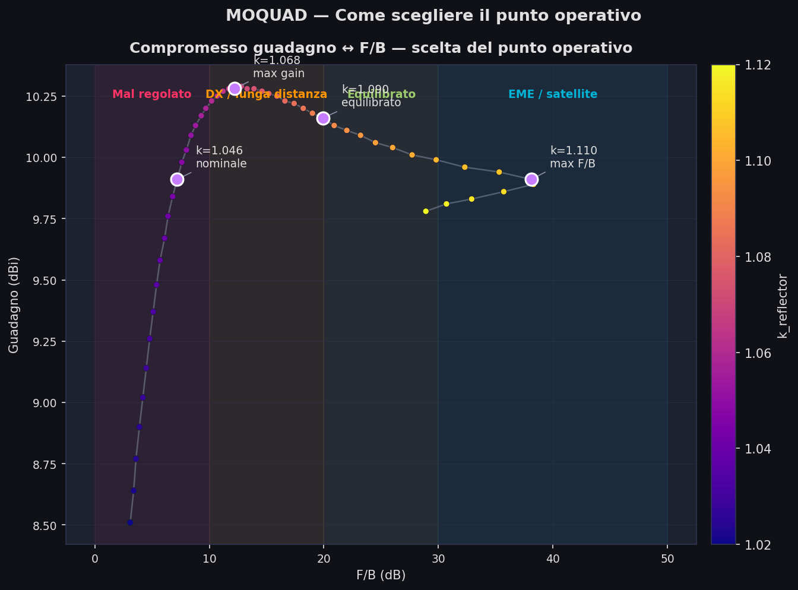
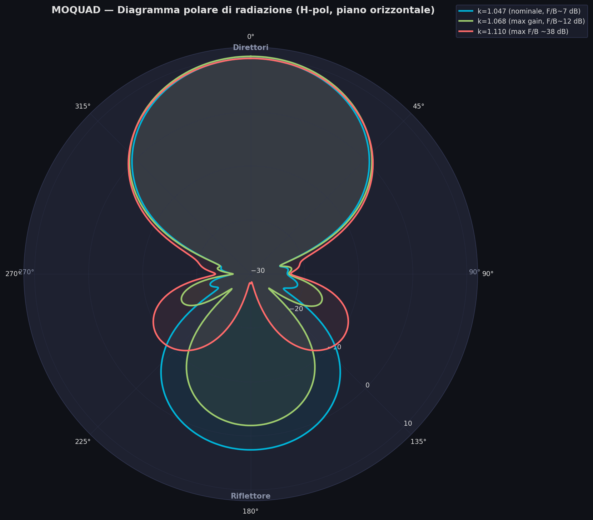
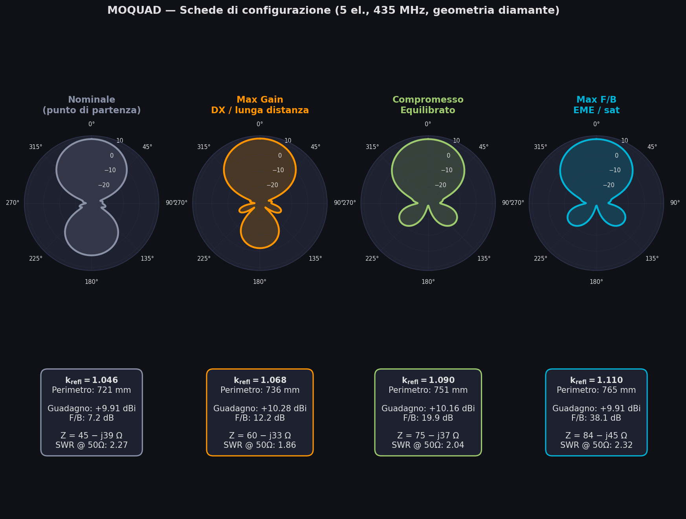
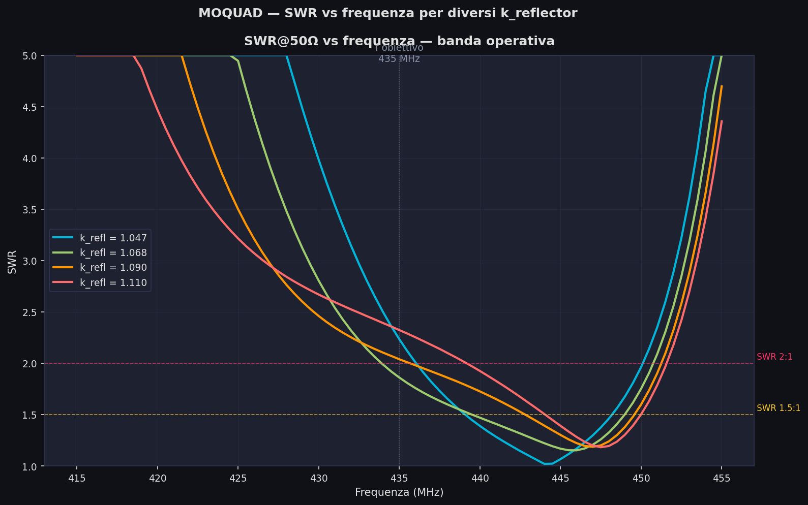

# Fondamenti teorici dell'antenna Cubical Quad

**Di EA4IPW — Complemento teorico alla guida OpenQuad**

Questo documento raccoglie i fondamenti teorici, le formule e i riferimenti che sostengono il design di un'antenna Cubical Quad. Il caso pratico di costruzione è documentato in [README.it.md](README.it.md).

La cubical quad è un'antenna a elementi parassiti (come una Yagi) dove ogni elemento è un loop quadrato di una lunghezza d'onda completa. Rispetto a una Yagi equivalente, offre ~2 dB in più di guadagno per lo stesso numero di elementi, un miglior rapporto front-to-back, e un'impedenza di feedpoint più vicina a 50 Ω.

Le formule e le procedure di questa guida sono valide per qualsiasi frequenza.

---

## 1. Le formule e da dove vengono

### 1.1. La costante base: dalla velocità della luce al valore magico "1005"

Questa costante appare pubblicata nella bibliografia delle antenne dagli anni 1960 (vedi riferimenti alla fine), ma vediamo da dove viene.

La lunghezza d'onda nel vuoto è:

    λ = c / f

Dove c = 299,792,458 m/s. Espressa in piedi:

    λ (piedi) = 983.57 / f(MHz)

Un loop quadrato di una lunghezza d'onda non risuona esattamente a λ teorica. Gli effetti della corrente che circola negli angoli e la curvatura del campo fanno sì che debba essere leggermente più lungo (~2.2%) per risuonare. Questo dà la costante empirica classica:

    983.57 × 1.021 ≈ 1005

**Nota:** A differenza di un dipolo, che si *accorcia* del ~5% rispetto al teorico (da 492 a 468) a causa dell'"end effect" alle sue estremità aperte, un loop chiuso ha bisogno di essere *più lungo* perché non ha estremità aperte.

### 1.2. Formule per ogni elemento

Le formule danno il **perimetro totale del loop**:

| Elemento | Perimetro (piedi) | Perimetro (mm) | Origine |
|---|---|---|---|
| Driven element | 1005 / f | 1005 / f × 304.8 | Risonanza a f |
| Riflettore | 1030 / f | 1030 / f × 304.8 | ~2.5% più lungo → induttivo |
| Direttore 1 | 975 / f | 975 / f × 304.8 | ~3% più corto → capacitivo |
| Direttore N+1 | Direttore_N × 0.97 | Direttore_N × 0.97 | Serie del 3% |

Dove f è in MHz.

**Dimensioni derivate:**

- Lunghezza di un lato del quadrato: `lato = perimetro / 4`
- Lunghezza del braccio spreader (dal centro all'angolo): `spreader = lato × √2 / 2 = lato × 0.7071`

### 1.3. Da dove escono le costanti 1030 e 975

Non sono arbitrarie. Partono dalla costante base del driven element (1005):

| Costante | Calcolo | Funzione |
|---|---|---|
| 1005 | 984 × 1.021 | Loop risonante alla frequenza di lavoro |
| 1030 | 1005 × 1.025 | Riflettore: 2.5% più lungo → risuona al di sotto → induttivo |
| 975 | 1005 × 0.970 | Direttore: 3% più corto → risuona al di sopra → capacitivo |

Il riflettore induttivo e il direttore capacitivo producono la fase necessaria perché l'antenna irradi in una sola direzione (dal riflettore verso i direttori).

### 1.4. Spaziature tra gli elementi

| Tratto | Distanza |
|---|---|
| Riflettore → Driven | 0.20λ |
| Driven → Direttore 1 | 0.15λ |
| Direttore → Direttore | 0.15λ |

Dove λ è la lunghezza d'onda nello spazio libero:

    λ (mm) = 300,000 / f(MHz)
    λ (pollici) = 11,811 / f(MHz)
    λ (piedi) = 984 / f(MHz)

**Importante:** Le spaziature dipendono dalla lunghezza d'onda nello spazio libero, NON dal velocity factor del cavo. Il boom misura sempre lo stesso indipendentemente dal tipo di cavo che usi per gli elementi.

### 1.5. Scelta della spaziatura riflettore→driven: compromesso guadagno vs F/B

La bibliografia mostra una certa dispersione sulla spaziatura ottimale tra riflettore e
driven. I due riferimenti più comuni sono:

| Fonte | R→Driven | Direttori | Obiettivo di progetto |
|---|---|---|---|
| ARRL Antenna Book / Orr & Cowan | **0.200 λ** | 0.150 λ | Massimo guadagno |
| W6SAI / calcolatori classici (es. YT1VP) | **0.186 λ** | 0.153 λ | Compromesso guadagno/F/B |

Il valore 0.186 λ dei calcolatori classici deriva dalla costante storica `730 ft·MHz`
espressa in unità imperiali:

    spacing_piedi = 730 / f(MHz) × 0.25  →  spacing/λ = 730×0.25 / 983.57 ≈ 0.1855 λ

#### Risultato della simulazione NEC2 (5 elementi, 435 MHz)

È stato effettuato uno sweep di k_riflettore con `nec2c` per entrambe le configurazioni di
spaziatura. Il modello replica la geometria reale della MOQUAD: **loop ruotati di 45°
(orientamento a diamante)**, con feed sul vertice inferiore (angolo S) per polarizzazione
orizzontale. La differenza di guadagno tra le due spaziature è **trascurabile** (< 0.05 dBi),
mentre il F/B massimo raggiungibile varia:

| Configurazione | k_refl ottimale | Guadagno di picco | F/B massimo |
|---|---|---|---|
| OpenQuad 0.200 λ | 1.110 | 10.10 dBi (7.95 dBd) | **37.8 dB** |
| YT1VP  0.186 λ | 1.108 | 10.12 dBi (7.97 dBd) | **42.3 dB** |

Con il k_refl nominale (1.047) entrambe le configurazioni danno praticamente lo stesso
risultato: ~10.1 dBi e ~7.2 dB di F/B. La differenza di F/B emerge soltanto quando il
riflettore è regolato verso il punto di massima cancellazione (riflettore più lungo →
maggiore sfasamento induttivo).

**Conclusione pratica:** per una costruzione tipica in cui la lunghezza del riflettore viene
aggiustata tramite uno stub o tagliando il loop, la spaziatura più corta dei calcolatori
classici offre **~4.5 dB in più di F/B** nel punto ottimo con lo stesso guadagno. Se
l'obiettivo prioritario è il F/B (rigetto interferenze, EME, contest a direzione fissa),
usa 0.186 λ; se l'obiettivo è il massimo guadagno con F/B sufficiente, usa 0.200 λ.

Lo script NEC2 che genera questa analisi si trova in `tools/nec2_spacing_analysis.py`
(vedi §6 di questo documento).

> **Riferimenti:** vedi §5 — Cebik W4RNL *Cubical Quad Notes* vol. 1, cap. 3
> (https://antenna2.github.io/cebik/content/bookant.html); ARRL Antenna Book cap. 12;
> Tom Rauch W8JI — "Cubical Quad Antenna" (https://www.w8ji.com/quad_cubical_quad.htm);
> W6SAI *All About Cubical Quad Antennas*, pagg. 44–52.



### 1.6. Regolazione fine del riflettore: il compromesso guadagno ↔ F/B

I valori nominali del calcolatore (k_riflettore = 1.047, cioè 2.5% più lungo del driven)
sono un buon punto di partenza, ma **non l'ottimo**. In qualsiasi array parassita esiste
un compromesso fondamentale: il riflettore può essere accordato per **massimo guadagno in
avanti** oppure per **massima cancellazione posteriore (F/B)**, ma i due ottimi non
coincidono.

#### Risultato dello sweep NEC2 (5 elementi, 435 MHz, geometria a diamante)

| k_refl | Perimetro riflettore | Guadagno avanti | Guadagno dietro | F/B |
|---|---|---|---|---|
| 1.047 (nominale) | 722 mm | 9.94 dBi | +2.54 dBi | 7.4 dB |
| 1.068 (max gain) | 736 mm | **10.28 dBi** | −1.92 dBi | 12.2 dB |
| 1.090 (compromesso) | 751 mm | 10.16 dBi | −9.74 dBi | 19.9 dB |
| 1.110 (max F/B) | 765 mm | 9.91 dBi | **−28.2 dBi** | **38.1 dB** |

Osservazione chiave: **il guadagno in avanti cambia appena** (range di 0.37 dB in tutto lo
sweep), mentre il guadagno dietro crolla di **30 dB** passando dal riflettore nominale a
quello ottimizzato per F/B. Il F/B non si guadagna aumentando la radiazione frontale, bensì
cancellando quella posteriore.

#### Demistificazione: "dBi di guadagno" è il picco del diagramma

`dBi` misura il guadagno nella direzione di **massima radiazione** (picco del diagramma),
non una media né il guadagno in una direzione fissa. In una quad ben orientata quel picco
coincide con la direzione dei direttori (phi=0°), ma se l'array è mal regolato il picco
può deviare lateralmente. In questa analisi riportiamo sempre il guadagno a phi=0° (avanti),
che coincide con il picco in tutte le configurazioni dello sweep.

#### La risonanza del feedpoint si sposta — ma verso L'ALTO

Un equivoco comune: "se allungo il riflettore abbasso la frequenza di risonanza". In un
array parassita la realtà è opposta:

| k_refl | Z a 435 MHz | f_res del feedpoint (X=0) | SWR @ 50Ω @ 435 MHz |
|---|---|---|---|
| 1.047 | 45 − j39 Ω | 444 MHz (+9) | 2.24 |
| 1.068 | 60 − j33 Ω | 445 MHz (+10) | 1.86 |
| 1.090 | 75 − j37 Ω | 446 MHz (+11) | 2.04 |
| 1.110 | 84 − j45 Ω | 447 MHz (+12) | 2.33 |

Il driven non cambia — da solo risuona sempre vicino a 435 MHz. Ciò che cambia è
l'**accoppiamento mutuo** tra riflettore e driven. La matrice delle impedenze è:

    Z_in = Z_11 − Z_12² / Z_22

dove Z_11 è l'auto-impedenza del driven, Z_22 quella del riflettore e Z_12 la mutua.
Allungando il riflettore, Z_22 diventa più induttiva, il che modifica il termine
Z_12²/Z_22 in modo tale che la reattanza aggiunta al driven sia **capacitiva**. Questo
sposta la frequenza dove X=0 verso l'alto, non verso il basso.

In pratica, a 435 MHz il feedpoint resta sempre con reattanza capacitiva moderata
(X ≈ −35 a −45 Ω), gestibile con un gamma match, L-match o hairpin.

#### Procedura di regolazione iterativa

Per sfruttare il compromesso e portare l'antenna al punto ottimo:

1. **Costruisci** riflettore, driven e direttori con le dimensioni nominali del calcolatore
   (k_refl = 1.047), aggiungendo 15–20 mm di filo in più al perimetro del riflettore come
   margine di regolazione.

2. **Misura** il F/B puntando verso un beacon noto, oppure misura l'impedenza e la risonanza
   con un VNA.

3. **Allunga il riflettore a passi di ~5 mm** (aggiungendo filo o con uno stub regolabile),
   annotando il F/B dopo ogni passo. Il F/B salirà progressivamente.

4. **Fermati** quando il F/B inizia a scendere o diventa instabile — hai superato il punto
   ottimo. Torna indietro di mezzo passo.

5. **Riaccorda il matching** (gamma/L/hairpin) dopo aver fissato la lunghezza del riflettore,
   perché la reattanza del feedpoint sarà cambiata rispetto al punto iniziale.

> **Nota operativa:** il riflettore si regola SEMPRE allungandolo rispetto al valore nominale.
> Per questo è più sensato costruire con margine extra e tagliare in caso di eccesso che
> restare corti e dover aggiungere filo.

#### Compromessi tipici raccomandati

- **Applicazioni a lungo raggio / DX**: k_refl ≈ 1.068 (736 mm @ 435 MHz) — massimizza il
  guadagno, F/B ragionevole di ~12 dB.
- **Ricezione di beacon con interferenze posteriori / rigetto intermodulazione**: k_refl ≈
  1.090 (751 mm) — perdi 0.1 dB di guadagno, guadagni 7.7 dB di F/B.
- **EME, satellite, contest a direzione fissa**: k_refl ≈ 1.108 (764 mm) — F/B massimo di
  38 dB, guadagno quasi identico al nominale.

Questi valori valgono per 5 elementi. Per 2 o 3 elementi le differenze sono più marcate e
il compromesso è più duro — vedi Cebik, *Cubical Quad Notes* Vol. 1 cap. 3 per l'analisi
completa.





---

## 2. Il Velocity Factor (Vf): perché conta e come calcolarlo

### 2.1. Cos'è il Vf

Le formule della sezione precedente assumono **rame nudo nello spazio libero** (Vf = 1.0). Se usi cavo con isolamento (PVC, polietilene, teflon), l'onda viaggia più lentamente attraverso il conduttore, il che riduce la lunghezza fisica necessaria per risuonare alla stessa frequenza.

L'isolamento aumenta la capacità distribuita lungo il conduttore, rallentando la propagazione. Questo significa che hai bisogno di **meno cavo** per completare una lunghezza d'onda elettrica.

### 2.2. Valori tipici di Vf

| Tipo di cavo | Vf approssimativo |
|---|---|
| Rame nudo | 1.00 |
| Isolante PTFE/Teflon | 0.97–0.98 |
| Isolante polietilene | 0.95–0.96 |
| Isolante PVC sottile | 0.91–0.95 |
| Isolante PVC spesso (cavo da installazione 450/750V) | 0.90–0.93 |

**Attenzione:** Questi sono valori orientativi. Il Vf reale dipende dallo spessore dell'isolante rispetto al diametro del conduttore. Un cavo da installazione domestica (H07V-K, UNE-EN 50525) da 1.5 mm² ha una guaina PVC proporzionalmente più spessa rispetto allo stesso cavo da 6 mm², e quindi un Vf più basso.

### 2.3. Formule corrette con Vf

Moltiplica ogni costante per il Vf:

    Driven = (1005 × Vf) / f(MHz) × 304.8    (mm)
    Driven = (1005 × Vf) / f(MHz) × 12        (pollici)
    Driven = (1005 × Vf) / f(MHz)              (piedi)

Lo stesso per le costanti 1030 (riflettore) e 975 (direttore 1).

### 2.4. Come misurare il Vf del tuo cavo

Il metodo più diretto è empirico:

1. Calcola il perimetro del driven element usando le formule per rame nudo (Vf = 1.0).
2. Costruisci il loop.
3. Costruisci anche il riflettore.
4. Misura la sua risonanza utilizzando il NanoVNA.
5. Calcola il tuo Vf reale: **Vf = f_risonanza_misurata / f_obiettivo**

Per esempio: se hai calcolato per 435 MHz ma il loop risuona a 400 MHz, il tuo Vf è 400/435 = 0.92.

Nella mia esperienza, calcolare il Vf solo con l'elemento direttore non funzionerà,
è necessario avere il riflettore, la cui installazione sposta la frequenza verso il basso.

Questo funziona perché un Vf minore di 1 significa che l'insieme è elettricamente "troppo lungo" e risuona più in basso del previsto.

---

## 3. Calcolo delle dimensioni per qualsiasi frequenza

Per una frequenza centrale f (in MHz) e un velocity factor Vf:

**Perimetri (mm):**

    Riflettore  = (1030 × Vf) / f × 304.8
    Driven      = (1005 × Vf) / f × 304.8
    Direttore 1 = (975 × Vf) / f × 304.8
    Direttore 2 = Direttore 1 × 0.97
    Direttore 3 = Direttore 2 × 0.97
    ...e così via

**Perimetri (pollici):**

    Riflettore  = (1030 × Vf) / f × 12
    Driven      = (1005 × Vf) / f × 12
    Direttore 1 = (975 × Vf) / f × 12
    Direttore 2 = Direttore 1 × 0.97
    ...

**Spaziature (mm):** (indipendenti dal Vf)

    Riflettore → Driven:  300,000 / f × 0.20
    Driven → Direttore:   300,000 / f × 0.15
    Direttore → Direttore: 300,000 / f × 0.15

**Spaziature (pollici):**

    Riflettore → Driven:  11,811 / f × 0.20
    Driven → Direttore:   11,811 / f × 0.15
    Direttore → Direttore: 11,811 / f × 0.15

---

## 4. Prestazioni teoriche attese

### 4.1. Guadagno e F/B per configurazione

| Elementi | Guadagno appross. (dBd) | Guadagno appross. (dBi) | Rapporto F/B |
|---|---|---|---|
| 2 (R + DE) | ~5.5 | ~7.6 | 10–15 dB |
| 3 (R + DE + D1) | ~7.5 | ~9.6 | 15–20 dB |
| 4 (R + DE + D1 + D2) | ~8.5 | ~10.6 | 18–22 dB |
| 5 (R + DE + D1–D3) | ~9.2 | ~11.3 | 20–25 dB |
| 6 (R + DE + D1–D4) | ~9.7 | ~11.8 | 20–25 dB |
| 7 (R + DE + D1–D5) | ~10.0 | ~12.1 | 20–25 dB |

Valori in dBd (rispetto al dipolo) e dBi (rispetto all'isotropica). dBi = dBd + 2.15.

A partire da 4–5 elementi i rendimenti sono decrescenti (~0.5 dB per direttore aggiuntivo). Per la maggior parte delle applicazioni, 3–5 elementi è il punto ottimale tra guadagno, complessità e facilità di regolazione.

### 4.2. Equivalenza con Yagi

Come riferimento generale, una quad di N elementi rende approssimativamente come una Yagi di N+2 elementi con boom di lunghezza simile.

### 4.3. Verifica pratica del F/B

Sintonizza un ripetitore o una baliza conosciuta, punta l'antenna verso la sorgente, annota la lettura dell'S-meter, ruota di 180° e confronta. Ogni unità S di differenza equivale a ~6 dB secondo la norma IARU Region 1 R.1 (1981), anche se la calibrazione degli S-meter negli apparati commerciali può variare significativamente, specialmente al di sotto di S3 dove molti ricevitori forniscono solo 2–3 dB per unità S.

---

## 5. Riferimenti

### Libri e documenti tecnici

- **L. B. Cebik (W4RNL), "Cubical Quad Notes" — Volumi 1, 2 e 3.** Il riferimento definitivo sul design delle quad. Disponibile su: https://antenna2.github.io/cebik/content/bookant.html
- **William Orr (W6SAI), "All About Cubical Quad Antennas."** Il libro classico che ha reso popolare la quad tra i radioamatori.
- **ARRL Antenna Book — Chapter 12: Quad Arrays.** Fonte delle formule 1005/1030/975.

### Articoli online

- **L. B. Cebik (W4RNL) — "Cubical Quad Notes" (3 volumi).** Il riferimento definitivo sul
  design delle quad. Tutti i volumi disponibili in PDF su:
  https://antenna2.github.io/cebik/content/bookant.html
- **L. B. Cebik (W4RNL) — "2-Element Quads as a Function of Wire Diameter"** — Metodologia
  di ottimizzazione NEC che fissa il driven in risonanza e regola il riflettore per il
  massimo F/B. Documenta il compromesso guadagno↔F/B con dati NEC-4.
  https://antenna2.github.io/cebik/content/quad/q2l1.html
- **L. B. Cebik (W4RNL) — "The Quad vs. Yagi Question"** — Analisi comparativa con sweep
  parametrici. Conferma che le quad a 2 elementi non superano ~20 dB di F/B senza direttori.
  https://antenna2.github.io/cebik/content/quad/qyc.html
- **Tom Rauch (W8JI) — "Cubical Quad Antenna"** — Analisi tecnica rigorosa con dati NEC.
  Citazione diretta sul compromesso guadagno/F/B: *"if we optimize F/B ratio we can expect
  lower gain from any parasitic array"*. https://www.w8ji.com/quad_cubical_quad.htm
- **"Why the old formula of 1005/freq sometimes doesn't work for loop antennas"** — Effetto
  del Vf sui loop con cavo PVC. https://q82.uk/1005overf
- **Electronics Notes — "Yagi Feed Impedance & Matching"** — Spiega l'effetto
  dell'accoppiamento mutuo sull'impedenza del feedpoint: *"altering the element spacing
  has a greater effect on the impedance than it does the gain"*. https://www.electronics-notes.com/articles/antennas-propagation/yagi-uda-antenna-aerial/feed-impedance-matching.php
- **Wikipedia — "Yagi–Uda antenna" (sezione Mutual impedance)** — Formulazione matematica
  dell'accoppiamento Z_ij tra driven e parassiti. Chiave per capire perché allungare il
  riflettore SPOSTA la frequenza di risonanza del feedpoint (verso l'alto, non verso il basso).
  https://en.wikipedia.org/wiki/Yagi%E2%80%93Uda_antenna
- **KD2BD (John Magliacane) — "Thoughts on Perfect Impedance Matching of a Yagi"** —
  Matching di feedpoint con reattanza non nulla. Utile dopo aver ottimizzato il riflettore
  per il F/B, quando Z_in non è più 50 Ω. https://www.qsl.net/kd2bd/impedance_matching.html
- **Practical Antennas — Wire Quads:** https://practicalantennas.com/designs/loops/wirequad/
- **Electronics Notes — Cubical Quad Antenna:** https://www.electronics-notes.com/articles/antennas-propagation/cubical-quad-antenna/quad-basics.php

### Guide di costruzione

- **"Build a High Performance Two Element Tri-Band Cubical Quad" (KB5TX):** https://kb5tx.org/oldsite/DIY%20(Do%20it%20Youself)/Build%20a%20Hi-Performance%20Quad.pdf
- **"A Five-Element Quad Antenna for 2 Meters" (N5DUX):** http://www.n5dux.com/ham/files/pdf/Five-Element%20Quad%20Antenna%20for%202m.pdf
- **"Building a Quad Antenna":** https://www.computer7.com/building-a-quad-antenna/

### Calcolatori online

- **YT1VP Cubical Quad Calculator:** https://www.qsl.net/yt1vp/CUBICAL%20QUAD%20ANTENNA%20CALCULATOR.htm
  Usa una spaziatura R→DE ≈ 0.186 λ (costante `730 ft·MHz`) e tra direttori ≈ 0.153 λ
  (costante `600 ft·MHz`). Vedi §1.5 per il confronto con il valore 0.200 λ usato da OpenQuad.
- **CSGNetwork Cubical Quad Calculator:** http://www.csgnetwork.com/antennae5q2calc.html

### Libri consigliati (cartaceo)

- **James L. Lawson (W2PV) — "Yagi Antenna Design"** (ARRL, 1986, ISBN 0-87259-041-0).
  Riferimento classico sull'ottimizzazione computazionale degli array parassiti. La
  metodologia di sweep parametrico (variare k_refl mantenendo il driven fisso) usata da
  OpenQuad deriva direttamente da quest'opera.
- **William I. Orr (W6SAI) — "All About Cubical Quad Antennas"** (Radio Publications, 1959
  e edizioni successive). Origine storica delle costanti empiriche `730/f` e `600/f` per le
  spaziature; classico assoluto del mondo quad.
- **David B. Leeson — "Physical Design of Yagi Antennas"** (ARRL, 1992, ISBN 0-87259-381-9).
  Complementa Lawson con il progetto meccanico e i metodi di matching. Cebik lo raccomanda
  come *companion book* per capire a fondo gli array parassiti.
- **ARRL Antenna Book** (edizione attuale, ARRL). Il capitolo dedicato alle quad raccoglie
  le formule classiche 1005/1030/975 e il range di spaziature 0.14–0.25 λ.

### Norme citate

- **IARU Region 1 Technical Recommendation R.1 (1981):** Definizione dell'S-meter. 1 unità S = 6 dB, S9 in VHF = −93 dBm (5 µV in 50 Ω).

---

## 6. Analisi NEC2 della spaziatura tra gli elementi

### 6.1. Strumento richiesto

Le analisi di questo documento sono state realizzate con **nec2c**, implementazione libera
di NEC-2 (Numerical Electromagnetics Code). Installazione su Debian/Ubuntu:

```bash
sudo apt-get install nec2c
```

Su macOS con Homebrew:

```bash
brew install nec2c
```

### 6.2. Script di analisi: `tools/nec2_spacing_analysis.py`

Lo script genera i file di input NEC2, esegue le simulazioni e produce grafici comparativi.
Supporta tre modalità di analisi:

```bash
# MODO 1 — Sweep di k_refl per le due configurazioni di spaziatura (analisi §1.5)
python3 tools/nec2_spacing_analysis.py --freq 435 --elements 5

# MODO 2 — Analisi di regolazione del riflettore: guadagno + F/B + Z_in (dati §1.6)
python3 tools/nec2_spacing_analysis.py --freq 435 --elements 5 --reflector-tuning

# MODO 3 — Sweep di impedenza vs frequenza (Z_in, SWR, risonanza del feedpoint)
python3 tools/nec2_spacing_analysis.py --freq 435 --elements 5 --impedance-sweep

# Una sola configurazione personalizzata
python3 tools/nec2_spacing_analysis.py --freq 435 --elements 5 \
        --spacing-r-de 0.200 --spacing-dir 0.150

# Salvare i risultati in CSV
python3 tools/nec2_spacing_analysis.py --freq 435 --elements 5 --csv risultati.csv
```

Il modo `--reflector-tuning` riproduce la tabella di §1.6 (k=1.047, 1.068, 1.090, 1.110 con
guadagno, F/B, R, X e SWR). Usa la carta `PT -1` di NEC2 per leggere la corrente del segmento
di feed e calcolare Z_in = R + jX direttamente.

Il modo `--impedance-sweep` effettua uno sweep di ±15 MHz attorno alla frequenza obiettivo,
mostrando come la risonanza elettrica del feedpoint (dove X=0) si sposti verso l'alto
allungando il riflettore — il fenomeno documentato in §1.6.

### 6.3. Come funziona il modello NEC2 per una quad

La MOQUAD monta i loop **ruotati di 45° (orientamento a diamante)**, con i bracci spreader
rivolti a N/S/E/W e il filo che unisce le loro punte. Il modello NEC2 riflette questa
geometria reale.

Ogni loop è modellato come **4 conduttori rettilinei che formano un diamante** nel piano YZ.
Il boom corre lungo l'asse X. I quattro vertici sono nelle posizioni cardinali:

```
              N (0, +r)
             / \
            /   \
W (-r, 0) ●       ● E (+r, 0)
            \   /
             \ /
              S (0, -r)  ← feedpoint del driven
         +z
         |
    ─────●───── +y    r = lato × √2 / 2  (raggio = distanza centro→vertice)
```

Il feedpoint è posto sul **vertice S (inferiore)**, punto di alimentazione naturale per
**polarizzazione orizzontale**. La ragione:

- Da S, i conduttori W→S e S→E arrivano/partono a ±45°.
- Le loro componenti orizzontali (±Y) **si sommano** in S → corrente netta orizzontale.
- Le loro componenti verticali (±Z) **si cancellano** in S → nessuna contaminazione V-pol.

Il feed è implementato nell'**ultimo segmento del conduttore W→S** (quello più vicino al
vertice S). Più segmenti per lato, più vicino al vertice si trova il gap e migliore è l'XPD.
Con SEG=19 il gap dista ~4 mm dal vertice e l'XPD ≥ 27 dB. Con SEG=99 l'XPD supera 38 dB.

Conduttori in ordine orario (visti dal davanti, +X):

```
W1:  S → E   (conduttore in basso a destra)   ← direzione (+y, +z)/√2
W2:  E → N   (conduttore in alto a destra)    ← direzione (-y, +z)/√2
W3:  N → W   (conduttore in alto a sinistra)  ← direzione (-y, -z)/√2
W4:  W → S   (conduttore in basso a sinistra) ← direzione (+y, -z)/√2  ← FEED qui
```

Formato della carta GW di NEC2:

```
GW  tag  nseg  x1  y1  z1  x2  y2  z2  raggio
```

Esempio per il driven in x=0.1378 m, lato s=0.1760 m (r=0.1244 m), raggio=0.0005 m, SEG=19:

```
GW  5  19  0.1378   0.0000  -0.1244  0.1378  +0.1244   0.0000  0.0005   ← W1: S→E
GW  6  19  0.1378  +0.1244   0.0000  0.1378   0.0000  +0.1244  0.0005   ← W2: E→N
GW  7  19  0.1378   0.0000  +0.1244  0.1378  -0.1244   0.0000  0.0005   ← W3: N→W
GW  8  19  0.1378  -0.1244   0.0000  0.1378   0.0000  -0.1244  0.0005   ← W4: W→S (FEED)
```

L'eccitazione viene applicata all'**ultimo segmento** del conduttore W4 (W→S), quello più
vicino al vertice S:

```
EX  0  8  19  0  1  0     ← tag=8 (W4 del driven), seg=19 (ultimo), tensione unitaria
```

Il diagramma di radiazione orizzontale si ottiene con:

```
RP  0  1  361  1000  90  0  1  1       ← theta=90°, phi=0..360°, passo 1°
```

### 6.4. Interpretazione delle colonne del file .out

La sezione `RADIATION PATTERNS` del file di output ha questo formato:

```
  THETA    PHI    VERTC    HORIZ    TOTAL    AXIAL   TILT  SENSE  ...
 DEGREES  DEGREES   DB       DB       DB     RATIO  DEGREES
```

- **VERTC** (col 3): guadagno di polarizzazione verticale (dBi)
- **HORIZ** (col 4): guadagno di polarizzazione orizzontale (dBi)
- **TOTAL** (col 5): guadagno totale (dBi) — **la colonna principale**

Per la MOQUAD a diamante con feed in S, HORIZ ≈ TOTAL e VERTC resta ≥ 27 dB al di sotto
(XPD ≥ 27 dB con SEG=19). Leggere TOTAL per le analisi di guadagno e F/B è corretto.

```python
# Lettura base del diagramma in Python
gains = {}
with open("simulazione.out") as f:
    for line in f:
        parts = line.split()
        try:
            theta, phi = float(parts[0]), float(parts[1])
            if abs(theta - 90.0) < 0.1:
                gains[round(phi)] = float(parts[4])   # colonna TOTAL
        except (ValueError, IndexError):
            pass

gain_forward = gains.get(0, gains.get(360))   # phi=0° = direzione dei direttori (+X)
gain_back    = gains.get(180)                  # phi=180° = direzione del riflettore
fb_ratio     = gain_forward - gain_back        # F/B in dB
```



### 6.5. Validazione del modello

Per verificare che il modello a diamante sia corretto prima di fare lo sweep:

1. Simula il solo driven element (senza parassiti). L'impedenza di ingresso deve essere
   **~100 Ω resistiva** (loop quadrato a onda intera → 100–125 Ω; l'orientamento a 45° non
   cambia questo valore).
2. Verifica la polarizzazione: VERTC deve essere ≥ 25 dB al di sotto di HORIZ a phi=0°. Se
   la differenza è minore, il feedpoint è troppo lontano dal vertice → aumentare SEG.
3. Aggiungi il riflettore. Il guadagno deve salire di ~5 dBi rispetto al dipolo isotropo e
   il F/B deve essere ≥ 10 dB.
4. Verifica che il picco di guadagno punti verso i direttori (phi=0° nel modello, verso +X).
5. **Nota sul guadagno:** l'orientamento a diamante dà ~0.2 dBi in meno dell'orientamento a
   quadrato con side-feed, per la diversa proiezione della corrente nel piano di radiazione.
   È un effetto fisico reale, non un artefatto del modello.

---

*73 da EA4IPW — OpenQuad v1.0*
