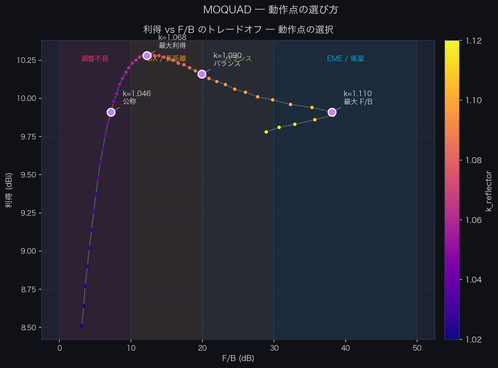
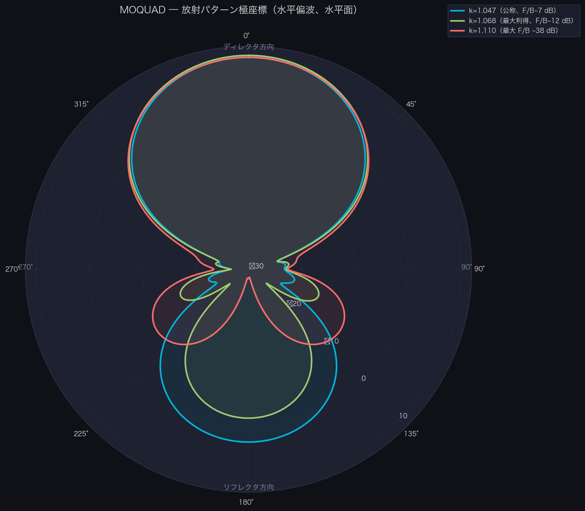
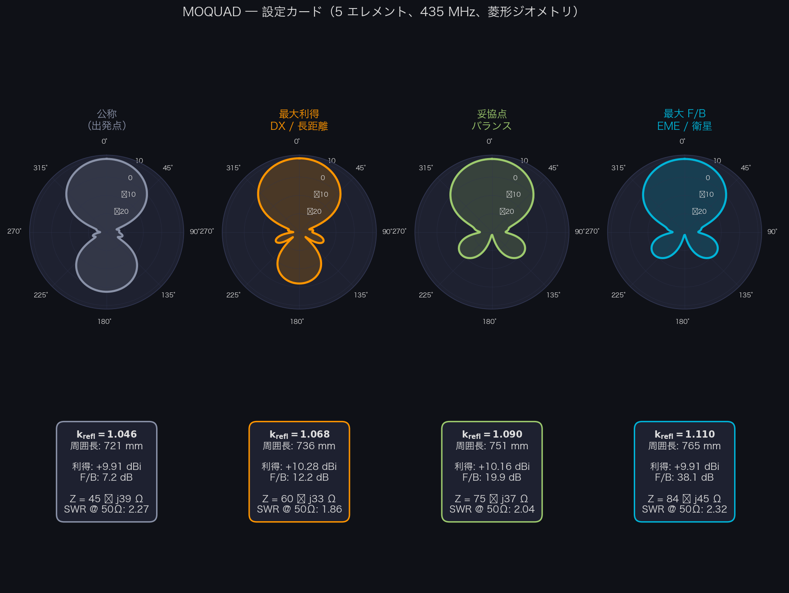
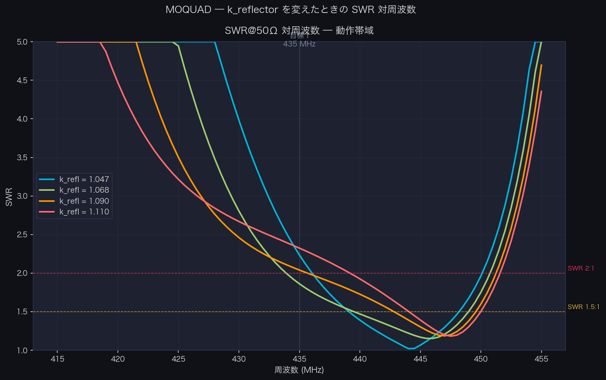

# Cubical Quad アンテナの理論的背景

**著者：EA4IPW — OpenQuad ガイドの理論的補足**

本ドキュメントでは、Cubical Quad アンテナの設計を支える理論的背景、公式、および参考文献をまとめます。製作の実例については [README.ja.md](README.ja.md) を参照してください。

Cubical Quad は、各エレメントが 1 波長分の正方形ループで構成される、寄生素子型アンテナ（Yagi と同様）です。同じエレメント数の Yagi に対して約 2 dB 高い利得、良好な front-to-back 比、そして 50 Ω により近い給電点インピーダンスを提供します。

本ガイドの公式と手順はどの周波数でも有効です。

---

## 1. 公式とその由来

### 1.1. 基本定数：光速から「1005」という魔法の値まで

この定数は 1960 年代以降のアンテナ関連文献に掲載されていますが（末尾の参考文献を参照）、その由来を見てみましょう。

真空中の波長は以下で与えられます。

    λ = c / f

ここで c = 299,792,458 m/s です。フィート単位では次のようになります。

    λ (pies) = 983.57 / f(MHz)

1 波長の正方形ループは、厳密に理論上の λ では共振しません。コーナーを流れる電流の影響と電界の曲がりのため、共振させるには少し長く（約 2.2%）する必要があります。これが古典的な経験定数を与えます。

    983.57 × 1.021 ≈ 1005

**注：** ダイポールは開放端での「end effect」により理論値から約 5% *短く*なる（492 から 468 へ）のに対し、閉じたループは開放端を持たないため、逆に*より長く*する必要があります。

### 1.2. 各エレメントの公式

公式は**ループの全周長**を与えます。

| エレメント | 周長 (pies) | 周長 (mm) | 由来 |
|---|---|---|---|
| ドリブンエレメント | 1005 / f | 1005 / f × 304.8 | f で共振 |
| リフレクター | 1030 / f | 1030 / f × 304.8 | 約 2.5% 長い → 誘導性 |
| ディレクター 1 | 975 / f | 975 / f × 304.8 | 約 3% 短い → 容量性 |
| ディレクター N+1 | Director_N × 0.97 | Director_N × 0.97 | 3% 系列 |

ここで f は MHz 単位です。

**派生寸法：**

- 正方形の 1 辺の長さ：`辺 = 周長 / 4`
- スプレッダー腕の長さ（中心からコーナーまで）：`spreader = 辺 × √2 / 2 = 辺 × 0.7071`

### 1.3. 定数 1030 と 975 の由来

これらは恣意的なものではありません。ドリブンエレメントの基本定数（1005）を出発点とします。

| 定数 | 計算 | 機能 |
|---|---|---|
| 1005 | 984 × 1.021 | 動作周波数で共振するループ |
| 1030 | 1005 × 1.025 | リフレクター：2.5% 長い → 下方で共振 → 誘導性 |
| 975 | 1005 × 0.970 | ディレクター：3% 短い → 上方で共振 → 容量性 |

誘導性リフレクターと容量性ディレクターは、アンテナを単一方向（リフレクターからディレクター方向）に放射させるために必要な位相を生み出します。

### 1.4. エレメント間の間隔

| 区間 | 距離 |
|---|---|
| リフレクター → ドリブン | 0.20λ |
| ドリブン → ディレクター 1 | 0.15λ |
| ディレクター → ディレクター | 0.15λ |

ここで λ は自由空間での波長です。

    λ (mm) = 300,000 / f(MHz)
    λ (pulgadas) = 11,811 / f(MHz)
    λ (pies) = 984 / f(MHz)

**重要：** 間隔は自由空間での波長に依存し、ケーブルの Velocity Factor には依存しません。エレメントにどのような種類のケーブルを使っても、ブームの長さは常に同じです。

### 1.5. リフレクタ→ドリブン間隔の選択：利得と F/B のトレードオフ

リフレクタとドリブンの最適間隔については、文献にある程度のばらつきがあります。よく引用さ
れる 2 つの参照値は次のとおりです。

| 出典 | R→Driven | ディレクタ | 設計目標 |
|---|---|---|---|
| ARRL Antenna Book / Orr & Cowan | **0.200 λ** | 0.150 λ | 最大利得 |
| W6SAI / 古典的な計算機（例：YT1VP） | **0.186 λ** | 0.153 λ | 利得/F/B の妥協 |

古典的な計算機が使う 0.186 λ という値は、ヤード・ポンド単位で表された歴史的定数
`730 ft·MHz` に由来します。

    spacing_ft = 730 / f(MHz) × 0.25  →  spacing/λ = 730×0.25 / 983.57 ≈ 0.1855 λ

#### NEC2 シミュレーション結果（5 エレメント、435 MHz）

`nec2c` を使って両方の間隔構成について k_reflector スイープを行いました。モデルは MOQUAD
の実際のジオメトリ、すなわち **45° 回転（ダイヤモンド姿勢）のループ** を再現しており、
水平偏波のために下頂点（S コーナー）に給電点を置いています。結果を見ると、2 つの間隔構成
の間の利得の差は **無視できる**（< 0.05 dBi）のに対して、達成可能な最大 F/B は変化します。

| 構成 | 最適 k_refl | ピーク利得 | 最大 F/B |
|---|---|---|---|
| OpenQuad 0.200 λ | 1.110 | 10.10 dBi (7.95 dBd) | **37.8 dB** |
| YT1VP  0.186 λ | 1.108 | 10.12 dBi (7.97 dBd) | **42.3 dB** |

k_refl の公称値（1.047）では、両方の構成はほぼ同じ結果を与えます：~10.1 dBi、F/B は
~7.2 dB。F/B の差は、リフレクタを最大キャンセル点に向けて調整したとき（リフレクタを長く
する → 誘導性位相シフトが大きくなる）にのみ現れます。

**実用上の結論：** スタブやループのトリミングでリフレクタ長を調整する典型的な製作では、
古典的な計算機の短い間隔のほうが最適点で同じ利得で **~4.5 dB 多い F/B** を提供します。
F/B が最優先（干渉除去、EME、方位固定のコンテスト）なら 0.186 λ を使い、十分な F/B を
持ちつつ最大利得を狙うなら 0.200 λ を使ってください。

この解析を生成する NEC2 スクリプトは `tools/nec2_spacing_analysis.py` にあります
（本文書の §6 を参照）。

> **参考文献：** §5 を参照 — Cebik W4RNL *Cubical Quad Notes* vol. 1, 第 3 章
> (https://antenna2.github.io/cebik/content/bookant.html); ARRL Antenna Book 第 12 章；
> Tom Rauch W8JI — "Cubical Quad Antenna" (https://www.w8ji.com/quad_cubical_quad.htm);
> W6SAI *All About Cubical Quad Antennas*, pp. 44–52.



### 1.6. リフレクタの微調整：利得 ↔ F/B のトレードオフ

計算機の公称値（k_reflector = 1.047、すなわちドリブンより 2.5% 長い）は妥当な出発点です
が、**最適ではありません**。寄生素子アレイには根本的なトレードオフが存在します。リフレ
クタは **最大前方利得** または **最大後方キャンセル（F/B）** のどちらか一方に調整できま
すが、2 つの最適点は一致しません。

#### NEC2 スイープ結果（5 エレメント、435 MHz、ダイヤモンドジオメトリ）

| k_refl | リフレクタ周囲長 | 前方利得 | 後方利得 | F/B |
|---|---|---|---|---|
| 1.047（公称） | 722 mm | 9.94 dBi | +2.54 dBi | 7.4 dB |
| 1.068（max gain） | 736 mm | **10.28 dBi** | −1.92 dBi | 12.2 dB |
| 1.090（妥協点） | 751 mm | 10.16 dBi | −9.74 dBi | 19.9 dB |
| 1.110（max F/B） | 765 mm | 9.91 dBi | **−28.2 dBi** | **38.1 dB** |

重要な観察：**前方利得はほとんど変化しません**（スイープ全体で 0.37 dB の範囲）。一方、
後方利得は公称リフレクタから F/B 最適化リフレクタに切り替えると **30 dB も落ちます**。
F/B は前方放射を増やすことで得られるのではなく、後方放射をキャンセルすることで得られる
のです。

#### 誤解を解く：「利得の dBi」はパターンのピーク

`dBi` は **最大放射** 方向（パターンのピーク）の利得を測るのであって、平均や固定方向の
利得ではありません。正しく整列されたクアドでは、そのピークはディレクタ方向（phi=0°）と
一致しますが、アレイの調整が悪いとピークが横方向にずれる可能性があります。本解析では
常に phi=0°（前方）の利得を報告しており、これはスイープのすべての構成でピークと一致し
ます。

#### 給電点の共振は動く — ただし上方向に

よくある誤解：「リフレクタを長くすると共振周波数が下がる」。寄生アレイでは現実はその
逆です。

| k_refl | 435 MHz での Z | 給電点の f_res (X=0) | SWR @ 50Ω @ 435 MHz |
|---|---|---|---|
| 1.047 | 45 − j39 Ω | 444 MHz (+9) | 2.24 |
| 1.068 | 60 − j33 Ω | 445 MHz (+10) | 1.86 |
| 1.090 | 75 − j37 Ω | 446 MHz (+11) | 2.04 |
| 1.110 | 84 − j45 Ω | 447 MHz (+12) | 2.33 |

ドリブンは変わらない — 単独では常に 435 MHz 付近で共振します。変わるのはリフレクタと
ドリブン間の **相互結合** です。インピーダンス行列は次のとおりです。

    Z_in = Z_11 − Z_12² / Z_22

ここで Z_11 はドリブン自身のインピーダンス、Z_22 はリフレクタ自身のインピーダンス、
Z_12 は相互インピーダンスです。リフレクタを長くすると Z_22 がより誘導性になり、
Z_12²/Z_22 の項が変化して、ドリブンに加わるリアクタンスは **容量性** になります。これ
により X=0 となる周波数は下方向ではなく上方向に移動します。

実際には、435 MHz では給電点は常に適度な容量性リアクタンス（X ≈ −35 〜 −45 Ω）を持ち、
ガンママッチ、L マッチ、ヘアピンで処理できます。

#### 反復調整手順

このトレードオフを活用し、アンテナを最適点に追い込むには：

1. **製作** リフレクタ、ドリブン、ディレクタを計算機の公称寸法（k_refl = 1.047）で作り、
   リフレクタ周囲長に 15〜20 mm の余長を追加して調整代とします。

2. **測定** 既知のビーコンにアンテナを向けて F/B を測るか、VNA でインピーダンスと共振を
   測ります。

3. **リフレクタを ~5 mm ステップで延ばす**（配線を継ぎ足すか可変スタブで）。各ステップ
   後の F/B を記録します。F/B は徐々に上昇します。

4. **停止** F/B が下がり始めたり不安定になったら、最適点を過ぎています。半ステップ戻して
   ください。

5. **マッチング再調整**（ガンマ/L/ヘアピン）をリフレクタ長を固定した後に行います。給電
   点のリアクタンスが開始時から変化しているためです。

> **運用メモ：** リフレクタは常に公称値から延ばすことで調整します。だからこそ、余長を
> 持たせて作り、行き過ぎたら切るほうが、短く作って配線を継ぎ足すよりも賢明です。

#### 推奨される典型的な妥協点

- **長距離 / DX 用途**：k_refl ≈ 1.068（436 MHz @ 736 mm）— 利得を最大化、F/B は ~12 dB
  と合理的。
- **後方干渉を受けながらのビーコン受信 / 混変調除去**：k_refl ≈ 1.090 (751 mm) — 利得を
  0.1 dB 失い、F/B を 7.7 dB 稼ぎます。
- **EME、衛星、方位固定コンテスト**：k_refl ≈ 1.108 (764 mm) — 最大 F/B 38 dB、利得は
  公称値とほぼ同じ。

これらの値は 5 エレメント用です。2〜3 エレメントでは差がより顕著で、トレードオフが厳し
くなります — 完全な解析は Cebik *Cubical Quad Notes* Vol. 1 第 3 章を参照してください。





---

## 2. Velocity Factor (Vf)：なぜ重要で、どう計算するか

### 2.1. Vf とは何か

前節の公式は**自由空間中の裸銅線**（Vf = 1.0）を仮定しています。絶縁付きケーブル（PVC、ポリエチレン、テフロン）を使うと、波が導体内をより遅く伝わるため、同じ周波数で共振するのに必要な物理的な長さは短くなります。

絶縁は導体に沿った分布容量を増やし、伝搬を遅くします。つまり、1 波長の電気的な長さを完成させるのに**必要なケーブルの長さは短く**なります。

### 2.2. Vf の典型的な値

| ケーブルの種類 | おおよその Vf |
|---|---|
| 裸銅線 | 1.00 |
| PTFE/テフロン絶縁 | 0.97–0.98 |
| ポリエチレン絶縁 | 0.95–0.96 |
| 薄い PVC 絶縁 | 0.91–0.95 |
| 厚い PVC 絶縁（450/750V 設置ケーブル） | 0.90–0.93 |

**注意：** これらは目安の値です。実際の Vf は、導体直径に対する絶縁の厚さに依存します。家庭用の配線ケーブル（H07V-K、UNE-EN 50525）の 1.5 mm² は、同じ 6 mm² ケーブルよりも比例的に厚い PVC 被覆を持っており、そのため Vf はより低くなります。

### 2.3. Vf による補正後の公式

各定数に Vf を掛けます。

    Driven = (1005 × Vf) / f(MHz) × 304.8    (mm)
    Driven = (1005 × Vf) / f(MHz) × 12        (pulgadas)
    Driven = (1005 × Vf) / f(MHz)              (pies)

リフレクター用 1030 とディレクター 1 用 975 についても同様です。

### 2.4. ケーブルの Vf を測定する方法

最も直接的な方法は実験的なものです。

1. 裸銅線用の公式（Vf = 1.0）でドリブンエレメントの周長を計算します。
2. ループを製作します。
3. リフレクターも製作します。
4. NanoVNA を使って共振周波数を測定します。
5. 実際の Vf を計算します：**Vf = f_共振_実測 / f_目標**

たとえば、435 MHz を狙って計算したのにループが 400 MHz で共振した場合、Vf = 400/435 = 0.92 となります。

私の経験上、ディレクターエレメント単独で Vf を計算することはうまくいきません。リフレクターが必要で、その設置が周波数を下方にシフトさせます。

これが機能するのは、Vf が 1 より小さいということは、全体が電気的に「長すぎる」ことを意味し、予想よりも下方で共振するためです。

---

## 3. 任意の周波数における寸法の計算

中心周波数 f（MHz）と Velocity Factor Vf について：

**周長 (mm)：**

    Reflector   = (1030 × Vf) / f × 304.8
    Driven      = (1005 × Vf) / f × 304.8
    Director 1  = (975 × Vf) / f × 304.8
    Director 2  = Director 1 × 0.97
    Director 3  = Director 2 × 0.97
    ...以下同様

**周長 (pulgadas)：**

    Reflector   = (1030 × Vf) / f × 12
    Driven      = (1005 × Vf) / f × 12
    Director 1  = (975 × Vf) / f × 12
    Director 2  = Director 1 × 0.97
    ...

**間隔 (mm)：**（Vf に依存しません）

    Reflector → Driven:   300,000 / f × 0.20
    Driven → Director:    300,000 / f × 0.15
    Director → Director:  300,000 / f × 0.15

**間隔 (pulgadas)：**

    Reflector → Driven:   11,811 / f × 0.20
    Driven → Director:    11,811 / f × 0.15
    Director → Director:  11,811 / f × 0.15

---

## 4. 期待される理論性能

### 4.1. 構成別の利得と F/B 比

| エレメント数 | 概算利得 (dBd) | 概算利得 (dBi) | F/B 比 |
|---|---|---|---|
| 2 (R + DE) | ~5.5 | ~7.6 | 10–15 dB |
| 3 (R + DE + D1) | ~7.5 | ~9.6 | 15–20 dB |
| 4 (R + DE + D1 + D2) | ~8.5 | ~10.6 | 18–22 dB |
| 5 (R + DE + D1–D3) | ~9.2 | ~11.3 | 20–25 dB |
| 6 (R + DE + D1–D4) | ~9.7 | ~11.8 | 20–25 dB |
| 7 (R + DE + D1–D5) | ~10.0 | ~12.1 | 20–25 dB |

値は dBd（ダイポール基準）および dBi（等方性基準）です。dBi = dBd + 2.15。

4〜5 エレメントを超えると収穫逓減となり、ディレクター 1 本追加あたり約 0.5 dB しか増えません。ほとんどの用途では、利得、複雑さ、調整の容易さの間で 3〜5 エレメントが最適点です。

### 4.2. Yagi との等価性

一般的な目安として、N エレメントのクワッドは同程度のブーム長を持つ N+2 エレメントの Yagi とほぼ同等の性能を発揮します。

### 4.3. F/B 比の実地検証

既知のレピーターまたはビーコンに同調し、アンテナを音源に向け、S メーターの読み値を記録してから 180° 回して比較します。IARU Region 1 R.1（1981）の規格によれば、S メーター 1 単位の差は約 6 dB に相当しますが、商用機の S メーター較正はかなりばらつく場合があり、特に S3 以下では多くの受信機で S 単位あたり 2〜3 dB しか差がないことがあります。

---

## 5. 参考文献

### 書籍と技術文書

- **L. B. Cebik (W4RNL), "Cubical Quad Notes" — Volumes 1, 2, 3.** クワッド設計に関する決定版の参考文献。次で入手可能：https://antenna2.github.io/cebik/content/bookant.html
- **William Orr (W6SAI), "All About Cubical Quad Antennas."** ハムの間でクワッドを広めた古典的な書籍。
- **ARRL Antenna Book — Chapter 12: Quad Arrays.** 1005/1030/975 公式の出典。

### オンライン記事

- **L. B. Cebik (W4RNL) — "Cubical Quad Notes"（全 3 巻）** クワッド設計の決定版。すべて
  の巻が次で PDF で入手できます：https://antenna2.github.io/cebik/content/bookant.html
- **L. B. Cebik (W4RNL) — "2-Element Quads as a Function of Wire Diameter"** — ドリブンを
  共振に固定し、リフレクタを最大 F/B に調整する NEC 最適化手法。NEC-4 データで利得↔F/B の
  トレードオフを文書化しています。https://antenna2.github.io/cebik/content/quad/q2l1.html
- **L. B. Cebik (W4RNL) — "The Quad vs. Yagi Question"** — パラメトリックスイープによる
  比較解析。ディレクタなしの 2 エレクワッドでは F/B が ~20 dB を超えないことを確認。
  https://antenna2.github.io/cebik/content/quad/qyc.html
- **Tom Rauch (W8JI) — "Cubical Quad Antenna"** — NEC データを伴う厳密な技術解析。利得/
  F/B トレードオフに関する直接の引用：*"if we optimize F/B ratio we can expect lower
  gain from any parasitic array"* https://www.w8ji.com/quad_cubical_quad.htm
- **"Why the old formula of 1005/freq sometimes doesn't work for loop antennas"** — PVC
  ケーブルのループにおける Vf の影響。https://q82.uk/1005overf
- **Electronics Notes — "Yagi Feed Impedance & Matching"** — 相互結合が給電点インピー
  ダンスに与える影響を説明：*"altering the element spacing has a greater effect on the
  impedance than it does the gain"* https://www.electronics-notes.com/articles/antennas-propagation/yagi-uda-antenna-aerial/feed-impedance-matching.php
- **Wikipedia — "Yagi–Uda antenna"（Mutual impedance のセクション）** — ドリブンと寄生素
  子の間の Z_ij 結合の数式化。リフレクタを長くすると給電点の共振周波数が下方向ではなく
  上方向に移動する理由を理解するための鍵。
  https://en.wikipedia.org/wiki/Yagi%E2%80%93Uda_antenna
- **KD2BD (John Magliacane) — "Thoughts on Perfect Impedance Matching of a Yagi"** — リ
  アクタンスがゼロではない給電点のマッチング。リフレクタを F/B 用に最適化したあと Z_in
  が 50 Ω でなくなったときに有用。https://www.qsl.net/kd2bd/impedance_matching.html
- **Practical Antennas — Wire Quads：** https://practicalantennas.com/designs/loops/wirequad/
- **Electronics Notes — Cubical Quad Antenna：** https://www.electronics-notes.com/articles/antennas-propagation/cubical-quad-antenna/quad-basics.php

### 製作ガイド

- **"Build a High Performance Two Element Tri-Band Cubical Quad" (KB5TX)：** https://kb5tx.org/oldsite/DIY%20(Do%20it%20Youself)/Build%20a%20Hi-Performance%20Quad.pdf
- **"A Five-Element Quad Antenna for 2 Meters" (N5DUX)：** http://www.n5dux.com/ham/files/pdf/Five-Element%20Quad%20Antenna%20for%202m.pdf
- **"Building a Quad Antenna"：** https://www.computer7.com/building-a-quad-antenna/

### オンライン計算機

- **YT1VP Cubical Quad Calculator：** https://www.qsl.net/yt1vp/CUBICAL%20QUAD%20ANTENNA%20CALCULATOR.htm
  R→DE 間隔 ≈ 0.186 λ（定数 `730 ft·MHz`）、ディレクタ間隔 ≈ 0.153 λ（定数 `600 ft·MHz`）
  を使用。OpenQuad が使う 0.200 λ との比較は §1.5 を参照してください。
- **CSGNetwork Cubical Quad Calculator：** http://www.csgnetwork.com/antennae5q2calc.html

### 推奨書籍（紙媒体）

- **James L. Lawson (W2PV) — "Yagi Antenna Design"**（ARRL, 1986, ISBN 0-87259-041-0）
  寄生素子アレイの計算機最適化に関する古典的な文献。OpenQuad が使うパラメトリックスイー
  プ手法（ドリブンを固定して k_refl を変える）はこの書籍に直接由来します。
- **William I. Orr (W6SAI) — "All About Cubical Quad Antennas"**（Radio Publications,
  1959 および以降の版）間隔のための経験的定数 `730/f` と `600/f` の歴史的出典；クワッド
  世界の絶対的な古典。
- **David B. Leeson — "Physical Design of Yagi Antennas"**（ARRL, 1992, ISBN
  0-87259-381-9）Lawson を機械設計とマッチング手法で補完。Cebik は寄生素子アレイを深く
  理解するための *companion book* として推奨しています。
- **ARRL Antenna Book**（最新版、ARRL）クワッドに関する章に、古典的な 1005/1030/975 の
  公式と間隔範囲 0.14〜0.25 λ がまとめられています。

### 引用規格

- **IARU Region 1 Technical Recommendation R.1 (1981)：** S メーターの定義。1 S 単位 = 6 dB、VHF での S9 = −93 dBm（50 Ω で 5 µV）。

---

## 6. エレメント間隔の NEC2 解析

### 6.1. 必要なツール

本文書の解析は **nec2c**（NEC-2 の自由実装、Numerical Electromagnetics Code）で行われまし
た。Debian/Ubuntu でのインストール：

```bash
sudo apt-get install nec2c
```

macOS の Homebrew では：

```bash
brew install nec2c
```

### 6.2. 解析スクリプト：`tools/nec2_spacing_analysis.py`

このスクリプトは NEC2 入力ファイルを生成し、シミュレーションを実行して比較グラフを作成し
ます。3 つの解析モードをサポートします。

```bash
# モード 1 — 2 種類の間隔構成について k_refl スイープ（§1.5 の解析）
python3 tools/nec2_spacing_analysis.py --freq 435 --elements 5

# モード 2 — リフレクタ調整の解析：利得 + F/B + Z_in（§1.6 のデータ）
python3 tools/nec2_spacing_analysis.py --freq 435 --elements 5 --reflector-tuning

# モード 3 — 周波数に対するインピーダンススイープ（Z_in、SWR、給電点共振）
python3 tools/nec2_spacing_analysis.py --freq 435 --elements 5 --impedance-sweep

# カスタム構成を 1 つだけ
python3 tools/nec2_spacing_analysis.py --freq 435 --elements 5 \
        --spacing-r-de 0.200 --spacing-dir 0.150

# 結果を CSV に保存
python3 tools/nec2_spacing_analysis.py --freq 435 --elements 5 --csv results.csv
```

`--reflector-tuning` モードは §1.6 の表（k=1.047, 1.068, 1.090, 1.110、利得、F/B、R、X、
SWR）を再現します。NEC2 の `PT -1` カードを使って給電セグメントの電流を読み、Z_in = R + jX
を直接計算します。

`--impedance-sweep` モードは目標周波数の周囲 ±15 MHz をスイープし、リフレクタを長くする
につれて給電点の電気的共振（X=0 の点）が上方向に移動する様子を示します — これは §1.6 で
文書化した現象です。

### 6.3. NEC2 モデルがクワッドでどう動作するか

MOQUAD はループを **45° 回転（ダイヤモンド姿勢）** で取り付けており、スプレッダーアームを
N/S/E/W に向け、その先端をワイヤでつないでいます。NEC2 モデルはこの実際のジオメトリを反映
しています。

各ループエレメントは YZ 平面上で **ダイヤモンド形を成す 4 本の直線導体** としてモデル化さ
れます。ブームは X 軸に沿って配置されます。4 つの頂点は方位位置にあります。

```
              N (0, +r)
             / \
            /   \
W (-r, 0) ●       ● E (+r, 0)
            \   /
             \ /
              S (0, -r)  ← ドリブンの給電点
         +z
         |
    ─────●───── +y    r = 辺 × √2 / 2 （半径 = 中心→頂点の距離）
```

給電点は **S 頂点（下部）** に配置されます。これは **水平偏波** にとって自然な給電点で
す。理由：

- S から、W→S と S→E の導体は ±45° で到達/出発します。
- 水平成分（±Y）は S で **加算** されます → 正味の水平電流。
- 垂直成分（±Z）は S で **打ち消し合い** ます → V 偏波の混入なし。

給電は **W→S ワイヤの最終セグメント**（頂点 S に最も近い）に配置されます。1 辺のセグメン
ト数が多いほどギャップは頂点に近づき、XPD が改善します。SEG=19 のときギャップは頂点から
~4 mm で XPD ≥ 27 dB。SEG=99 のとき XPD は 38 dB を超えます。

時計回りのワイヤの順序（+X 方向から見て）：

```
W1:  S → E   （右下のワイヤ）    ← 方向 (+y, +z)/√2
W2:  E → N   （右上のワイヤ）    ← 方向 (-y, +z)/√2
W3:  N → W   （左上のワイヤ）    ← 方向 (-y, -z)/√2
W4:  W → S   （左下のワイヤ）    ← 方向 (+y, -z)/√2  ← 給電はここ
```

NEC2 の GW カード形式：

```
GW  tag  nseg  x1  y1  z1  x2  y2  z2  半径
```

ドリブン（x=0.1378 m、辺 s=0.1760 m（r=0.1244 m）、半径=0.0005 m、SEG=19）の例：

```
GW  5  19  0.1378   0.0000  -0.1244  0.1378  +0.1244   0.0000  0.0005   ← W1: S→E
GW  6  19  0.1378  +0.1244   0.0000  0.1378   0.0000  +0.1244  0.0005   ← W2: E→N
GW  7  19  0.1378   0.0000  +0.1244  0.1378  -0.1244   0.0000  0.0005   ← W3: N→W
GW  8  19  0.1378  -0.1244   0.0000  0.1378   0.0000  -0.1244  0.0005   ← W4: W→S (FEED)
```

励振は W4（W→S）の **最終セグメント**、頂点 S に最も近い位置に適用されます：

```
EX  0  8  19  0  1  0     ← tag=8（ドリブンの W4）、seg=19（最終）、単位電圧
```

水平放射パターン全体は次で得られます：

```
RP  0  1  361  1000  90  0  1  1       ← theta=90°、phi=0..360°、1° ステップ
```

### 6.4. .out ファイルの列の解釈

出力ファイルの `RADIATION PATTERNS` セクションはこの形式です：

```
  THETA    PHI    VERTC    HORIZ    TOTAL    AXIAL   TILT  SENSE  ...
 DEGREES  DEGREES   DB       DB       DB     RATIO  DEGREES
```

- **VERTC**（列 3）：垂直偏波利得 (dBi)
- **HORIZ**（列 4）：水平偏波利得 (dBi)
- **TOTAL**（列 5）：総利得 (dBi) — **主要な列**

S 給電のダイヤモンド MOQUAD では、HORIZ ≈ TOTAL で VERTC は ≥ 27 dB 下にあります
（SEG=19 で XPD ≥ 27 dB）。利得と F/B の解析には TOTAL を読むのが正しい選択です。

```python
# Python でのパターン読み取りの基本
gains = {}
with open("simulation.out") as f:
    for line in f:
        parts = line.split()
        try:
            theta, phi = float(parts[0]), float(parts[1])
            if abs(theta - 90.0) < 0.1:
                gains[round(phi)] = float(parts[4])   # TOTAL 列
        except (ValueError, IndexError):
            pass

gain_forward = gains.get(0, gains.get(360))   # phi=0° = ディレクタの方向 (+X)
gain_back    = gains.get(180)                  # phi=180° = リフレクタの方向
fb_ratio     = gain_forward - gain_back        # F/B (dB)
```



### 6.5. モデルの検証

スイープを実行する前にダイヤモンドモデルが正しいことを確認するには：

1. ドリブンエレメント単独（寄生素子なし）でシミュレートします。入力インピーダンスは
   **~100 Ω 抵抗性** であるべきです（1 波長の正方形ループ → 100〜125 Ω；45° の姿勢はこの
   値を変えません）。
2. 偏波を確認：VERTC は phi=0° で HORIZ より ≥ 25 dB 下であるべきです。差がそれより小さ
   い場合、給電点が頂点から遠すぎます → SEG を増やします。
3. リフレクタを追加します。利得は等方性ダイポールに対して ~5 dBi 上昇し、F/B は ≥ 10 dB
   であるべきです。
4. 利得ピークがディレクタ方向を向くこと（モデルでは phi=0°、+X 方向）を確認します。
5. **利得に関する注記：** ダイヤモンド姿勢は、サイド給電の正方形姿勢に比べて放射面内の
   電流の投影が異なるため、~0.2 dBi 低くなります。これは実際の物理効果であり、モデルの
   アーチファクトではありません。

---

*73 from EA4IPW — OpenQuad v1.0*
