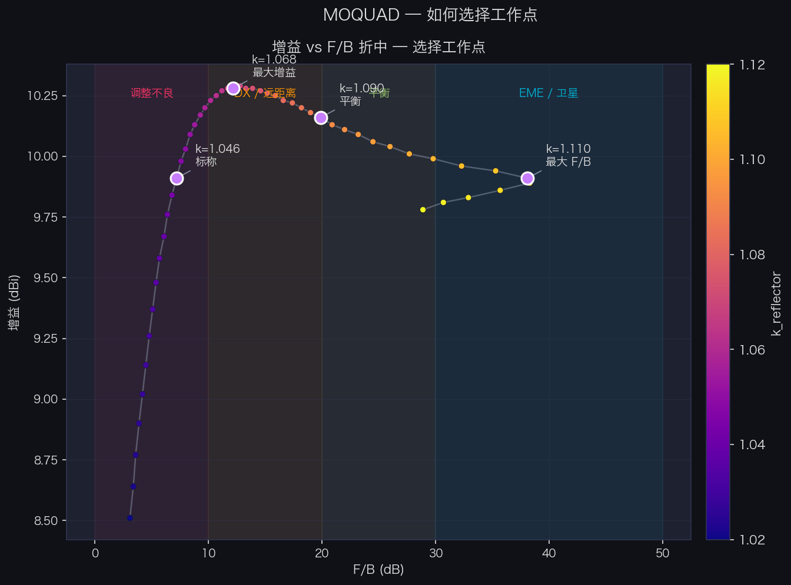
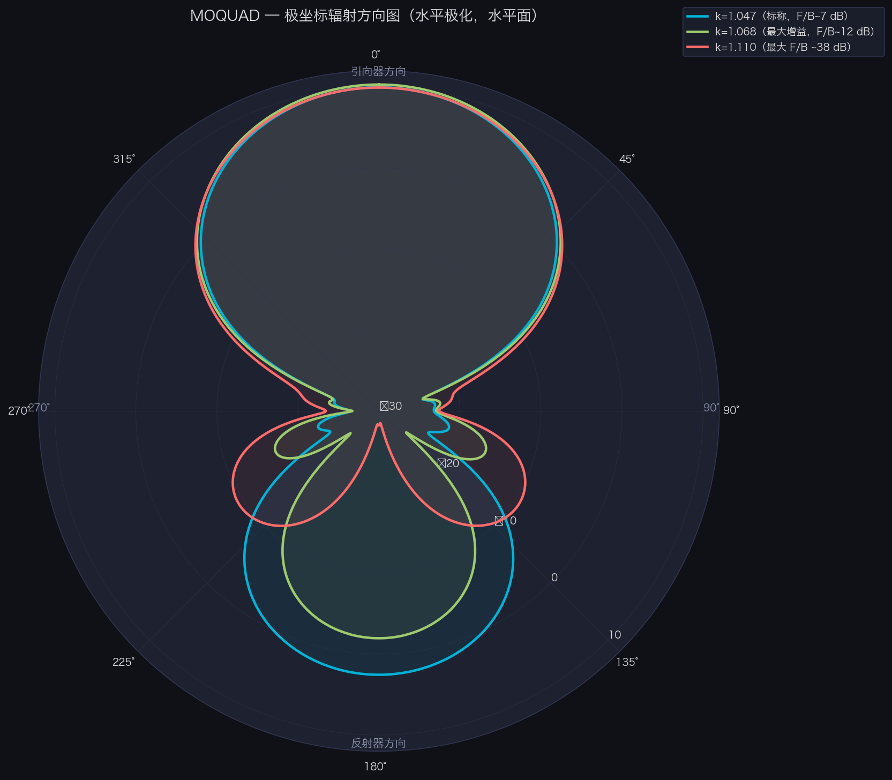
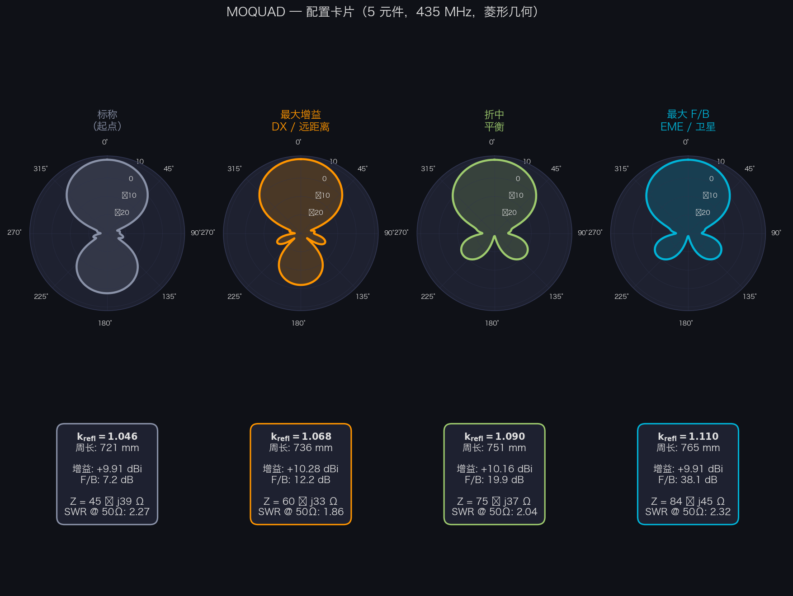
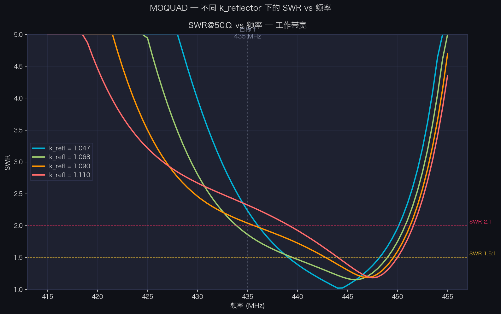

# Cubical Quad 天线的理论基础

**作者 EA4IPW —— OpenQuad 指南的理论补充**

本文档汇总了支撑 Cubical Quad 天线设计的理论基础、公式与参考文献。实际建造的案例记录在 [README.zh.md](README.zh.md)。

Cubical Quad 是一种带有寄生元件的天线（类似 Yagi），其中每个元件都是一个周长为整个波长的方形环。与同等数量元件的 Yagi 相比，它的增益高约 2 dB，前后比更好，且馈电点阻抗更接近 50 Ω。

本指南的公式与步骤对任何频率都适用。

---

## 1. 公式及其来源

### 1.1. 基本常数：从光速到神奇的数值「1005」

这个常数自 1960 年代以来就在天线文献中出现（参见末尾的参考文献），但我们还是看一下它的来源。

真空中的波长为：

    λ = c / f

其中 c = 299,792,458 m/s。以英尺表示：

    λ (pies) = 983.57 / f(MHz)

一个周长为整个波长的方形环并不会精确地在理论上的 λ 处谐振。由于电流绕过角部以及场的曲率，它需要稍长一点（约 2.2%）才能谐振。这就得到了经典的经验常数：

    983.57 × 1.021 ≈ 1005

**注：** 与偶极子不同 —— 偶极子由于开放端部的「end effect」会比理论值*缩短*约 5%（从 492 缩为 468）—— 一个闭合的 loop 需要*更长*，因为它没有开放端部。

### 1.2. 各元件的公式

这些公式给出的是**整个 loop 的总周长**：

| 元件 | 周长 (pies) | 周长 (mm) | 来源 |
|---|---|---|---|
| 驱动元 | 1005 / f | 1005 / f × 304.8 | 在 f 处谐振 |
| 反射器 | 1030 / f | 1030 / f × 304.8 | 长约 2.5% → 感性 |
| 引向器 1 | 975 / f | 975 / f × 304.8 | 短约 3% → 容性 |
| 引向器 N+1 | Director_N × 0.97 | Director_N × 0.97 | 3% 递减序列 |

其中 f 以 MHz 为单位。

**派生尺寸：**

- 正方形一边的长度：`lado = perímetro / 4`
- 撑杆臂长（从中心到角部）：`spreader = lado × √2 / 2 = lado × 0.7071`

### 1.3. 常数 1030 与 975 的来源

它们并非随意取值，而是基于驱动元的基本常数（1005）推导而来：

| 常数 | 计算 | 作用 |
|---|---|---|
| 1005 | 984 × 1.021 | 在工作频率谐振的 loop |
| 1030 | 1005 × 1.025 | 反射器：长 2.5% → 谐振频率偏低 → 感性 |
| 975 | 1005 × 0.970 | 引向器：短 3% → 谐振频率偏高 → 容性 |

感性反射器与容性引向器共同产生所需的相位，使天线朝单一方向辐射（从反射器指向引向器）。

### 1.4. 元件之间的间距

| 区段 | 距离 |
|---|---|
| 反射器 → 驱动元 | 0.20λ |
| 驱动元 → 引向器 1 | 0.15λ |
| 引向器 → 引向器 | 0.15λ |

其中 λ 是自由空间中的波长：

    λ (mm) = 300,000 / f(MHz)
    λ (pulgadas) = 11,811 / f(MHz)
    λ (pies) = 984 / f(MHz)

**重要：** 间距取决于自由空间中的波长，而**不**取决于导线的 velocity factor。无论你为元件使用何种导线，主梁的长度都保持一致。

### 1.5. 反射器→驱动单元间距的选择：增益与 F/B 的折中

关于反射器与驱动单元之间的最佳间距，文献中存在一定的差异。最常见的两个参考值为：

| 来源 | R→驱动 | 引向器 | 设计目标 |
|---|---|---|---|
| ARRL Antenna Book / Orr & Cowan | **0.200 λ** | 0.150 λ | 最大增益 |
| W6SAI / 经典计算器（如 YT1VP） | **0.186 λ** | 0.153 λ | 增益/F/B 折中 |

经典计算器所用的 0.186 λ 源自以英制单位表示的历史常数 `730 ft·MHz`：

    spacing_ft = 730 / f(MHz) × 0.25  →  spacing/λ = 730×0.25 / 983.57 ≈ 0.1855 λ

#### NEC2 仿真结果（5 元件，435 MHz）

使用 `nec2c` 对两种间距配置分别进行了 k_reflector 扫描。模型重现了 MOQUAD 的真实几何结构：
**旋转 45° 的环路（菱形姿态）**，并在下顶点（S 角）馈电以实现水平极化。结果表明两种间距
下的增益差异**可以忽略**（< 0.05 dBi），但可达到的最大 F/B 会有所不同：

| 配置 | 最优 k_refl | 峰值增益 | 最大 F/B |
|---|---|---|---|
| OpenQuad 0.200 λ | 1.110 | 10.10 dBi (7.95 dBd) | **37.8 dB** |
| YT1VP  0.186 λ | 1.108 | 10.12 dBi (7.97 dBd) | **42.3 dB** |

在标称 k_refl（1.047）下，两种配置给出的结果基本相同：~10.1 dBi，F/B 约 7.2 dB。F/B 的
差异只在反射器向最大抵消点调整时才出现（反射器更长 → 感性相移更大）。

**实用结论：** 在典型构建中——通过短接桩或修剪环路来调整反射器长度——经典计算器所用的
较短间距在最优点处能以相同的增益多提供 **~4.5 dB 的 F/B**。如果 F/B 是首要目标（抗干扰、
EME、方向固定的比赛），使用 0.186 λ；如果目标是在 F/B 足够的前提下追求最大增益，则使用
0.200 λ。

生成此分析的 NEC2 脚本位于 `tools/nec2_spacing_analysis.py`（请参阅本文档的 §6）。

> **参考文献：** 见 §5 — Cebik W4RNL *Cubical Quad Notes* 第 1 卷第 3 章
> (https://antenna2.github.io/cebik/content/bookant.html)；ARRL Antenna Book 第 12 章；
> Tom Rauch W8JI — "Cubical Quad Antenna" (https://www.w8ji.com/quad_cubical_quad.htm)；
> W6SAI *All About Cubical Quad Antennas*，第 44–52 页。



### 1.6. 反射器的精细调整：增益 ↔ F/B 折中

计算器的标称值（k_reflector = 1.047，即比驱动单元长 2.5%）是合理的起点，但**并非最优**。
任何寄生阵列中都存在一个根本性的折中：反射器可以调谐为**最大前向增益**，也可以调谐为
**最大后向抵消（F/B）**，但这两个最优点并不重合。

#### NEC2 扫描结果（5 元件，435 MHz，菱形几何）

| k_refl | 反射器周长 | 前向增益 | 后向增益 | F/B |
|---|---|---|---|---|
| 1.047（标称） | 722 mm | 9.94 dBi | +2.54 dBi | 7.4 dB |
| 1.068（max gain） | 736 mm | **10.28 dBi** | −1.92 dBi | 12.2 dB |
| 1.090（折中） | 751 mm | 10.16 dBi | −9.74 dBi | 19.9 dB |
| 1.110（max F/B） | 765 mm | 9.91 dBi | **−28.2 dBi** | **38.1 dB** |

关键观察：**前向增益几乎不变**（整个扫描范围仅 0.37 dB），而后向增益在从标称反射器切换
到 F/B 优化反射器时会下降 **30 dB**。F/B 不是靠增加前向辐射来获得的，而是靠抵消后向辐
射来获得的。

#### 破除迷思：「dBi 的增益」指的是方向图的峰值

`dBi` 衡量的是**最大辐射方向**（方向图峰值）的增益，并不是平均值或固定方向的增益。在
方向对准良好的四方天线中，该峰值与引向器方向（phi=0°）一致；但如果阵列调整不当，峰值
可能会侧偏。本分析始终报告 phi=0°（前向）的增益，在扫描的所有配置中，该方向都与峰值
一致。

#### 馈电点谐振发生偏移 —— 但是向**上**偏移

一个常见的误解：「延长反射器会降低谐振频率」。在寄生阵列中，事实正相反：

| k_refl | 435 MHz 下的 Z | 馈电点 f_res (X=0) | SWR @ 50Ω @ 435 MHz |
|---|---|---|---|
| 1.047 | 45 − j39 Ω | 444 MHz (+9) | 2.24 |
| 1.068 | 60 − j33 Ω | 445 MHz (+10) | 1.86 |
| 1.090 | 75 − j37 Ω | 446 MHz (+11) | 2.04 |
| 1.110 | 84 − j45 Ω | 447 MHz (+12) | 2.33 |

驱动单元本身并未改变 —— 单独运行时它仍在 435 MHz 附近谐振。改变的是反射器与驱动单元
之间的**互耦**。阻抗矩阵为：

    Z_in = Z_11 − Z_12² / Z_22

其中 Z_11 是驱动单元的自阻抗，Z_22 是反射器的自阻抗，Z_12 是互阻抗。延长反射器会使
Z_22 变得更具感性，这会改变 Z_12²/Z_22 项，使得加到驱动单元上的电抗变成**容性**。
这会让 X=0 的频率**向上**偏移，而不是向下。

实际上，在 435 MHz 时，馈电点总是保持适度的容性电抗（X ≈ −35 到 −45 Ω），可以用
gamma match、L match 或 hairpin 来处理。

#### 迭代调整流程

为了利用这一折中把天线推到最优点：

1. **构建** 反射器、驱动单元和引向器时使用计算器的标称尺寸（k_refl = 1.047），并给反射
   器周长多留 15–20 mm 作为调整余量。

2. **测量** 对准已知的信标测 F/B，或用 VNA 测量阻抗与谐振。

3. **每次延长反射器 ~5 mm**（加导线或使用可调短接桩），在每一步后记录 F/B。F/B 会逐步
   上升。

4. **停止** 当 F/B 开始下降或变得不稳定时 —— 你已经越过了最优点。回退半步。

5. **重新调整匹配**（gamma/L/hairpin）在固定反射器长度之后进行，因为馈电点的电抗已经
   相对于起点发生了变化。

> **操作提示：** 反射器**始终**是从标称值延长来调整的。因此，建议多留一些余量并在超调
> 时修剪，比留得太短再去接线更合理。

#### 推荐的典型折中

- **远距离 / DX 应用**：k_refl ≈ 1.068（435 MHz 下 736 mm）—— 最大化增益，F/B 合理，约
  12 dB。
- **信标接收伴随后向干扰 / 抑制互调**：k_refl ≈ 1.090 (751 mm) —— 损失 0.1 dB 增益，换
  来 7.7 dB F/B。
- **EME、卫星、方向固定比赛**：k_refl ≈ 1.108 (764 mm) —— 最大 F/B 38 dB，增益几乎与标
  称值相同。

这些数值适用于 5 元件配置。对于 2 或 3 元件，差异更为显著，折中也更为严苛 —— 完整分析
请参阅 Cebik *Cubical Quad Notes* 第 1 卷第 3 章。





---

## 2. Velocity Factor (Vf)：为什么重要以及如何计算

### 2.1. 什么是 Vf

前一节的公式假设使用**真空中的裸铜线**（Vf = 1.0）。如果使用带绝缘的导线（PVC、聚乙烯、特氟龙），波在导体中传播得更慢，从而减小了在相同频率谐振所需的物理长度。

绝缘层增加了沿导体分布的电容，减缓了传播。这意味着你需要**更少的导线**来完成一个电学波长。

### 2.2. 典型的 Vf 值

| 导线类型 | 近似 Vf |
|---|---|
| 裸铜线 | 1.00 |
| PTFE/特氟龙绝缘 | 0.97–0.98 |
| 聚乙烯绝缘 | 0.95–0.96 |
| 薄 PVC 绝缘 | 0.91–0.95 |
| 厚 PVC 绝缘（450/750V 安装导线） | 0.90–0.93 |

**注意：** 这些只是参考值。真实的 Vf 取决于绝缘层厚度相对于导体直径的比例。一根 1.5 mm² 的家用安装导线（H07V-K，UNE-EN 50525）的 PVC 外皮相对比 6 mm² 的同款导线要厚，因此 Vf 更低。

### 2.3. 考虑 Vf 修正后的公式

将每个常数乘以 Vf：

    Driven = (1005 × Vf) / f(MHz) × 304.8    (mm)
    Driven = (1005 × Vf) / f(MHz) × 12        (pulgadas)
    Driven = (1005 × Vf) / f(MHz)              (pies)

反射器的 1030 与引向器 1 的 975 同理处理。

### 2.4. 如何测量你导线的 Vf

最直接的方法是经验法：

1. 使用裸铜线的公式（Vf = 1.0）计算驱动元的周长。
2. 制作该环。
3. 同时制作反射器。
4. 用 NanoVNA 测量其谐振。
5. 计算真实的 Vf：**Vf = f_resonancia_medida / f_objetivo**

例如：如果你是为 435 MHz 计算的，但环在 400 MHz 处谐振，那么你的 Vf 就是 400/435 = 0.92。

根据我的经验，仅用引向器元件来计算 Vf 并不可行，
你需要有反射器，它的安装会使频率向下偏移。

这之所以可行，是因为小于 1 的 Vf 意味着整体在电学上「过长」，因此谐振在预期频率之下。

---

## 3. 任意频率下的尺寸计算

对于中心频率 f（以 MHz 为单位）与 velocity factor Vf：

**周长 (mm)：**

    Reflector   = (1030 × Vf) / f × 304.8
    Driven      = (1005 × Vf) / f × 304.8
    Director 1  = (975 × Vf) / f × 304.8
    Director 2  = Director 1 × 0.97
    Director 3  = Director 2 × 0.97
    ……以此类推

**周长 (pulgadas)：**

    Reflector   = (1030 × Vf) / f × 12
    Driven      = (1005 × Vf) / f × 12
    Director 1  = (975 × Vf) / f × 12
    Director 2  = Director 1 × 0.97
    ...

**间距 (mm)：**（与 Vf 无关）

    Reflector → Driven:   300,000 / f × 0.20
    Driven → Director:    300,000 / f × 0.15
    Director → Director:  300,000 / f × 0.15

**间距 (pulgadas)：**

    Reflector → Driven:   11,811 / f × 0.20
    Driven → Director:    11,811 / f × 0.15
    Director → Director:  11,811 / f × 0.15

---

## 4. 预期的理论性能

### 4.1. 各配置下的增益与 F/B

| 元件数 | 近似增益 (dBd) | 近似增益 (dBi) | 前后比 F/B |
|---|---|---|---|
| 2 (R + DE) | ~5.5 | ~7.6 | 10–15 dB |
| 3 (R + DE + D1) | ~7.5 | ~9.6 | 15–20 dB |
| 4 (R + DE + D1 + D2) | ~8.5 | ~10.6 | 18–22 dB |
| 5 (R + DE + D1–D3) | ~9.2 | ~11.3 | 20–25 dB |
| 6 (R + DE + D1–D4) | ~9.7 | ~11.8 | 20–25 dB |
| 7 (R + DE + D1–D5) | ~10.0 | ~12.1 | 20–25 dB |

dBd（相对偶极子）与 dBi（相对各向同性天线）的数值。dBi = dBd + 2.15。

从 4–5 单元起，收益逐渐减小（每增加一个引向器约 0.5 dB）。对大多数应用而言，3–5 单元是增益、复杂度与调谐便利性之间的最佳折中点。

### 4.2. 与 Yagi 的等效关系

作为一般参考，N 单元的 quad 在相近主梁长度下的表现大致等同于 N+2 单元的 Yagi。

### 4.3. F/B 的实际验证

调谐到一个已知的中继台或信标，将天线对准信源，记录 S 表读数，旋转 180° 再比较。根据 IARU Region 1 R.1（1981）规范，每一个 S 单位差约等于 6 dB，不过商用设备上 S 表的校准可能差异显著，尤其是在 S3 以下 —— 许多接收机在该区间每个 S 单位只对应 2–3 dB。

---

## 5. 参考文献

### 书籍与技术文档

- **L. B. Cebik (W4RNL), "Cubical Quad Notes" —— 卷 1、2、3。** 关于 quad 设计的权威参考。可在以下链接获取：https://antenna2.github.io/cebik/content/bookant.html
- **William Orr (W6SAI), "All About Cubical Quad Antennas."** 使 quad 在业余无线电界广为流传的经典之作。
- **ARRL Antenna Book —— Chapter 12: Quad Arrays.** 公式 1005/1030/975 的出处。

### 在线文章

- **L. B. Cebik (W4RNL) —— "Cubical Quad Notes"（共 3 卷）** 四方天线设计的权威参考。全
  部卷册均可在以下地址获取 PDF：https://antenna2.github.io/cebik/content/bookant.html
- **L. B. Cebik (W4RNL) —— "2-Element Quads as a Function of Wire Diameter"** —— 一种将
  驱动单元固定在谐振处、调整反射器以获得最大 F/B 的 NEC 优化方法。用 NEC-4 数据记录了
  增益↔F/B 的折中。https://antenna2.github.io/cebik/content/quad/q2l1.html
- **L. B. Cebik (W4RNL) —— "The Quad vs. Yagi Question"** —— 带参数扫描的比较分析。证实
  没有引向器的 2 元四方天线 F/B 不超过 ~20 dB。
  https://antenna2.github.io/cebik/content/quad/qyc.html
- **Tom Rauch (W8JI) —— "Cubical Quad Antenna"** —— 带 NEC 数据的严谨技术分析。关于增益
  /F/B 折中的直接引用：*"if we optimize F/B ratio we can expect lower gain from any
  parasitic array"*。https://www.w8ji.com/quad_cubical_quad.htm
- **"Why the old formula of 1005/freq sometimes doesn't work for loop antennas"** —— Vf
  对带 PVC 绝缘导线的环天线的影响。https://q82.uk/1005overf
- **Electronics Notes —— "Yagi Feed Impedance & Matching"** —— 解释互耦对馈电点阻抗的影
  响：*"altering the element spacing has a greater effect on the impedance than it
  does the gain"*。https://www.electronics-notes.com/articles/antennas-propagation/yagi-uda-antenna-aerial/feed-impedance-matching.php
- **Wikipedia —— "Yagi–Uda antenna"（Mutual impedance 部分）** —— 驱动单元与寄生单元间
  Z_ij 耦合的数学表述。理解为何延长反射器会使馈电点谐振频率**向上**偏移（而不是向下）
  的关键。https://en.wikipedia.org/wiki/Yagi%E2%80%93Uda_antenna
- **KD2BD (John Magliacane) —— "Thoughts on Perfect Impedance Matching of a Yagi"** ——
  非零电抗馈电点的匹配。当反射器为 F/B 优化后 Z_in 不再是 50 Ω 时特别有用。
  https://www.qsl.net/kd2bd/impedance_matching.html
- **Practical Antennas —— Wire Quads：** https://practicalantennas.com/designs/loops/wirequad/
- **Electronics Notes —— Cubical Quad Antenna：** https://www.electronics-notes.com/articles/antennas-propagation/cubical-quad-antenna/quad-basics.php

### 建造指南

- **"Build a High Performance Two Element Tri-Band Cubical Quad" (KB5TX)：** https://kb5tx.org/oldsite/DIY%20(Do%20it%20Youself)/Build%20a%20Hi-Performance%20Quad.pdf
- **"A Five-Element Quad Antenna for 2 Meters" (N5DUX)：** http://www.n5dux.com/ham/files/pdf/Five-Element%20Quad%20Antenna%20for%202m.pdf
- **"Building a Quad Antenna"：** https://www.computer7.com/building-a-quad-antenna/

### 在线计算器

- **YT1VP Cubical Quad Calculator：** https://www.qsl.net/yt1vp/CUBICAL%20QUAD%20ANTENNA%20CALCULATOR.htm
  使用 R→DE 间距 ≈ 0.186 λ（常数 `730 ft·MHz`），引向器间距 ≈ 0.153 λ（常数 `600 ft·MHz`）。
  与 OpenQuad 所用的 0.200 λ 的比较见 §1.5。
- **CSGNetwork Cubical Quad Calculator：** http://www.csgnetwork.com/antennae5q2calc.html

### 推荐书籍（纸质）

- **James L. Lawson (W2PV) —— "Yagi Antenna Design"**（ARRL，1986，ISBN 0-87259-041-0）。
  寄生阵列计算机优化的经典参考。OpenQuad 所用的参数扫描方法（固定驱动单元、变化 k_refl）
  直接来自这本书。
- **William I. Orr (W6SAI) —— "All About Cubical Quad Antennas"**（Radio Publications，
  1959 及后续版本）。间距经验常数 `730/f` 和 `600/f` 的历史来源；四方天线领域的绝对经典。
- **David B. Leeson —— "Physical Design of Yagi Antennas"**（ARRL，1992，ISBN
  0-87259-381-9）。以机械设计和匹配方法补充 Lawson 的内容。Cebik 推荐它作为深入理解寄生
  阵列的*配套读物*。
- **ARRL Antenna Book**（当前版本，ARRL）。四方天线章节汇总了经典的 1005/1030/975 公式
  和 0.14–0.25 λ 的间距范围。

### 所引用的标准

- **IARU Region 1 Technical Recommendation R.1 (1981)：** S 表的定义。1 个 S 单位 = 6 dB，VHF 下 S9 = −93 dBm（50 Ω 下的 5 µV）。

---

## 6. 元件间距的 NEC2 分析

### 6.1. 所需工具

本文档中的分析使用 **nec2c**（NEC-2 的自由实现，Numerical Electromagnetics Code）。在
Debian/Ubuntu 上安装：

```bash
sudo apt-get install nec2c
```

在 macOS 上使用 Homebrew：

```bash
brew install nec2c
```

### 6.2. 分析脚本：`tools/nec2_spacing_analysis.py`

该脚本生成 NEC2 输入文件、执行仿真并产生对比图。支持三种分析模式：

```bash
# 模式 1 —— 对两种间距配置扫描 k_refl（§1.5 的分析）
python3 tools/nec2_spacing_analysis.py --freq 435 --elements 5

# 模式 2 —— 反射器调整分析：增益 + F/B + Z_in（§1.6 的数据）
python3 tools/nec2_spacing_analysis.py --freq 435 --elements 5 --reflector-tuning

# 模式 3 —— 阻抗随频率扫描（Z_in、SWR、馈电点谐振）
python3 tools/nec2_spacing_analysis.py --freq 435 --elements 5 --impedance-sweep

# 只跑一种自定义配置
python3 tools/nec2_spacing_analysis.py --freq 435 --elements 5 \
        --spacing-r-de 0.200 --spacing-dir 0.150

# 把结果存为 CSV
python3 tools/nec2_spacing_analysis.py --freq 435 --elements 5 --csv results.csv
```

`--reflector-tuning` 模式重现 §1.6 的表格（k=1.047, 1.068, 1.090, 1.110，含增益、F/B、
R、X 和 SWR）。它使用 NEC2 的 `PT -1` 卡来读取馈电段的电流，并直接计算 Z_in = R + jX。

`--impedance-sweep` 模式在目标频率附近 ±15 MHz 范围内扫描，展示延长反射器时馈电点的
电谐振（X=0 处）如何**向上**偏移 —— 这正是 §1.6 中记录的现象。

### 6.3. 四方天线的 NEC2 模型是如何工作的

MOQUAD 把环路**旋转 45°（菱形姿态）** 安装，撑杆臂指向 N/S/E/W，并用导线连接它们的末
端。NEC2 模型反映了这一真实几何结构。

每个环路元件都被建模为 YZ 平面中**组成菱形的 4 根直导线**。主梁沿 X 轴延伸。四个顶点
位于方位位置：

```
              N (0, +r)
             / \
            /   \
W (-r, 0) ●       ● E (+r, 0)
            \   /
             \ /
              S (0, -r)  ← 驱动单元的馈电点
         +z
         |
    ─────●───── +y    r = 边长 × √2 / 2 （半径 = 中心→顶点距离）
```

馈电点设在 **S 顶点（下方）**，这是**水平极化**的自然馈电点。理由：

- 从 S 出发，W→S 与 S→E 两根导线以 ±45° 到达/离开。
- 它们的水平分量（±Y）在 S 处**相加** → 产生净水平电流。
- 它们的垂直分量（±Z）在 S 处**相互抵消** → 不产生 V 极化污染。

馈电实施在 **W→S 导线的最后一段**（最靠近 S 顶点的一段）。每一边的段数越多，馈电间隙
越靠近顶点，XPD 越好。SEG=19 时间隙距顶点 ~4 mm，XPD ≥ 27 dB。SEG=99 时 XPD 超过 38 dB。

顺时针方向的导线顺序（从前方 +X 看）：

```
W1:  S → E   （右下导线）    ← 方向 (+y, +z)/√2
W2:  E → N   （右上导线）    ← 方向 (-y, +z)/√2
W3:  N → W   （左上导线）    ← 方向 (-y, -z)/√2
W4:  W → S   （左下导线）    ← 方向 (+y, -z)/√2  ← 馈电处
```

NEC2 的 GW 卡格式：

```
GW  tag  nseg  x1  y1  z1  x2  y2  z2  半径
```

驱动单元示例（x=0.1378 m，边长 s=0.1760 m（r=0.1244 m），半径=0.0005 m，SEG=19）：

```
GW  5  19  0.1378   0.0000  -0.1244  0.1378  +0.1244   0.0000  0.0005   ← W1: S→E
GW  6  19  0.1378  +0.1244   0.0000  0.1378   0.0000  +0.1244  0.0005   ← W2: E→N
GW  7  19  0.1378   0.0000  +0.1244  0.1378  -0.1244   0.0000  0.0005   ← W3: N→W
GW  8  19  0.1378  -0.1244   0.0000  0.1378   0.0000  -0.1244  0.0005   ← W4: W→S (FEED)
```

激励施加在导线 W4（W→S）的**最后一段**，即最靠近 S 顶点的一段：

```
EX  0  8  19  0  1  0     ← tag=8（驱动单元的 W4），seg=19（最后一段），单位电压
```

完整的水平辐射方向图由以下语句得到：

```
RP  0  1  361  1000  90  0  1  1       ← theta=90°，phi=0..360°，1° 步长
```

### 6.4. .out 文件各列的解释

输出文件的 `RADIATION PATTERNS` 部分采用如下格式：

```
  THETA    PHI    VERTC    HORIZ    TOTAL    AXIAL   TILT  SENSE  ...
 DEGREES  DEGREES   DB       DB       DB     RATIO  DEGREES
```

- **VERTC**（第 3 列）：垂直极化增益 (dBi)
- **HORIZ**（第 4 列）：水平极化增益 (dBi)
- **TOTAL**（第 5 列）：总增益 (dBi) —— **主要使用这一列**

对于 S 处馈电的菱形 MOQUAD，HORIZ ≈ TOTAL，VERTC 低于 HORIZ ≥ 27 dB（SEG=19 时
XPD ≥ 27 dB）。分析增益和 F/B 时读取 TOTAL 是正确的选择。

```python
# Python 中读取方向图的基本方法
gains = {}
with open("simulation.out") as f:
    for line in f:
        parts = line.split()
        try:
            theta, phi = float(parts[0]), float(parts[1])
            if abs(theta - 90.0) < 0.1:
                gains[round(phi)] = float(parts[4])   # TOTAL 列
        except (ValueError, IndexError):
            pass

gain_forward = gains.get(0, gains.get(360))   # phi=0° = 引向器方向 (+X)
gain_back    = gains.get(180)                  # phi=180° = 反射器方向
fb_ratio     = gain_forward - gain_back        # F/B (dB)
```



### 6.5. 模型验证

在进行扫描之前验证菱形模型是否正确：

1. 仅仿真驱动单元（无寄生单元）。输入阻抗应为**~100 Ω 纯阻性**（整波长方形环路 →
   100–125 Ω；45° 姿态不会改变该值）。
2. 检查极化：VERTC 在 phi=0° 处应低于 HORIZ ≥ 25 dB。如果差值更小，说明馈电点距顶点太远
   → 增大 SEG。
3. 加入反射器。增益相对于各向同性偶极子应上升 ~5 dBi，F/B 应 ≥ 10 dB。
4. 验证增益峰值指向引向器（模型中的 phi=0°，即 +X 方向）。
5. **关于增益的说明：** 菱形姿态比侧面馈电的方形姿态少约 0.2 dBi，这是因为在辐射平面内
   电流投影不同。这是真实的物理效应，并不是模型的伪影。

---

*73 来自 EA4IPW —— OpenQuad v1.0*
